# 客服工作台 AI Copilot — MVP 详细设计

> **文档版本**：DD-V1.2
> **编写日期**：2026 年 5 月
> **文档定位**：开发详细设计稿，对应 MVP 上线版（Top 30 功能）
> **演进**：评审稿 V3.3 → DD-V1.0 → DD-V1.1 → **DD-V1.2**（本版）

> **DD-V1.2 主要变更（相对 DD-V1.1）**：基于专家评审 45 项建议落实 39 项（27 完全采纳 + 7 部分采纳 + 5 合并采纳）
>
> **关键修订**（详见附录 C 评审采纳说明）：
> 1. **M01 顺序修订（P0-7）**：先存历史再做触发判断，落实"全量保存"语义
> 2. **callSession 必校验（P0-8）**：缺失时 fail closed，不再用空 operatorId 推荐
> 3. **反馈接口指令校验（P0-6）**：directive_id 唯一约束 + 服务端校验 + 幂等控制
> 4. **Cookie 受控能力（P0-4）**：增加 Cookie 名白名单 + Cookie-域名绑定白名单
> 5. **URL 安全增强（P0-5）**：https 协议、生产禁 UAT、同名参数冲突策略
> 6. **熔断保护（P1-5）**：AI Feign 增加熔断（不做限流/Bulkhead）
> 7. **基础灰度白名单（P1-9）**：operatorId 白名单（不做完整灰度框架）
> 8. **Copilot 配置发布前基础校验（P1-8）**：action/mapping/item 一致性、URL 白名单、组合合法性（不是沙箱）
> 9. **trigger_log 字段扩展（P1-16）**：增加 result_status / reason_code / filter_stage 等
> 10. **意图树热加载（P1-7）**：新增 /admin/intent-tree/reload 接口
> 11. **多 Pod 配置一致性（P1-17）**：30 秒轮询版本号兜底
> 12. **前端权限 fail closed（P1-20）**：权限 API 不可用时不展示推荐
> 13. **新增"已知风险与待实现"章节**：明示简化项作为有意识决策（违背用户决策的简化项不采纳，但需明示）

---

## 目录

- [第一篇 概述](#第一篇-概述)
- [第二篇 系统架构](#第二篇-系统架构)
- [第三篇 核心模块详细设计](#第三篇-核心模块详细设计)
- [第四篇 数据模型](#第四篇-数据模型)
- [第五篇 接口设计](#第五篇-接口设计)
- [第六篇 关键流程](#第六篇-关键流程)
- [第七篇 部署与运维](#第七篇-部署与运维)
- [第八篇 代码可维护性](#第八篇-代码可维护性)
- [第九篇 实施计划](#第九篇-实施计划)
- [第十篇 后续待实现清单](#第十篇-后续待实现清单)
- [附录](#附录)

---

# 第一篇 概述

## 1. 背景与目标

### 1.1 业务痛点

信用卡客服工作台整合上百个功能入口，坐席通话时存在：

- **找功能慢**：上百个入口靠肌肉记忆定位，新坐席学习成本高
- **上下文切换多**：边听电话边操作，认知负荷大易出错
- **重复操作**：同类业务的查找路径高度重复，全靠手工

### 1.2 MVP 目标

```
基于 ASR 实时识别 + AI 意图识别，
帮助坐席快速找到对应功能入口，由坐席确认后打开。
```

**用户体感目标**：

```
客户说出诉求 → 5-8 秒内坐席看到推荐 → 坐席点击确认打开
```

### 1.3 关键约束

| 约束 | 具体情况 |
|------|----------|
| 后端技术栈 | Java + Spring Boot + Spring Cloud OpenFeign |
| 前端技术栈 | Vue2 + Ant Design Vue |
| ASR 链路 | Kafka 逐句推送，已上线 |
| AI 意图识别 | AI 团队提供 `getSopResult.json`，单意图返回 |
| 存量菜单系统 | `cs_menu_*` 表 + `cs_menu_version` CLOB 发布机制 |
| WebSocket | 工作台已有基础设施 |
| 应用日志 / 接口监控 | 行内已有基础设施，本期不做 |
| 权限校验 | 由前端控制，后端不参与 |

---

## 2. 本期范围

### 2.1 实现范围（13 项，DD-V1.2 调整）

| 编号 | 模块 | 说明 |
|------|------|------|
| 1 | ASR 事件接入 | Kafka 订阅 `cs.asr.sentences`；先保存历史再做触发过滤（P0-7） |
| 2 | 句间合并防抖 | 客户连续短句合并到一次意图查询 |
| 3 | 对话历史维护 | callId 维度内存 + Redis 持久化（**全量保存客户+坐席**） |
| 4 | callId-operatorId 绑定 | 来电弹屏时建立绑定；**缺失时 fail closed 不推荐**（P0-8） |
| 5 | 意图树（配置文件） | Spring 配置文件加载，**支持 Admin 接口热加载**（P1-7） |
| 6 | AI 接口对接 | Feign 调用，**调用前过滤只传客户消息**；**支持熔断**（P1-5） |
| 7 | 意图-功能映射匹配 | 单 intentCode → 多 actionId 候选 |
| 8 | 参数解析 | session/callMeta + **Cookie 受控占位符**（白名单 + 域名绑定，P0-4） |
| 9 | 跳转指令构建与推送 | URL 含占位符 + **多重安全校验**（P0-5）+ WebSocket 推送 |
| 10 | 反馈采集 | 4 种反馈 + **服务端指令校验 + 幂等约束**（P0-6） |
| 11 | 前端 SDK | 浮窗 + 推荐卡片 + 5 种打开方式 + Cookie 替换 + **权限 API fail closed**（P1-20） |
| 12 | 业务监控埋点 | 触发日志 + 反馈日志落库（**仅落库，不做看板**） |
| 13 | **配置发布基础校验**（DD-V1.2 新增 P1-8） | 一键发布前校验必填字段、URL 白名单、组合合法性 |

### 2.2 本期不做（明确清单）

| 不做项 | 原因 | 待实现编号 |
|--------|------|----------|
| 二阶段页面自动化操作 | 后续单独立项 | F01 |
| ASR 实体抽取（正则/LLM） | 待 AI 团队提供能力 | F02/F03 |
| 多意图并存识别 | 接口不支持 | - |
| 澄清机制（多卡选择交互） | 简化，坐席页面手动切换 | F04 |
| 对话历史脱敏 | 复用 Redis 过期保护 | F05 |
| AI 调用前脱敏 | 行内大模型不外传 | F05 |
| 敏感数据保护框架 | 待行内合规要求适配 | F05 |
| 配置编辑/发布完整状态机 | 简化为 enabled 单字段 | F06 |
| 灰度发布机制（完整） | 仅做最简坐席白名单 | F07 |
| 跨环境配置同步 | 后续独立设计 | F08 |
| 配置沙箱（含 AI 评估） | 仅做基础校验 | F09 |
| 业务效果看板 | 仅落库 | F10 |
| 配置质量看板 | 仅落库 | F11 |
| 应用日志、接口监控基础设施 | 行内已有 | - |
| 服务端权限校验 | 前端控制 | F13 |
| URL 一次性 token 改造 | 涉及目标系统 | **F14（DD-V1.2 新增）** |

### 2.3 已知风险与待实现说明（DD-V1.2 新增）

> 本节明确列出 MVP 期间的已知简化项及其潜在风险，作为**有意识的工程权衡**记录在案，
> 区别于"未发现"的设计缺陷。所有简化项均有对应的待实现路径（F 编号）和扩展点预留。

| 已知风险 | 影响 | 缓解措施（本期） | 长期解决方案 |
|---------|------|----------------|------------|
| 对话历史含敏感原文 | Redis 中可能含身份证/手机号/卡号等 | Redis TTL 1 小时自动清理；不外传 | F05 数据脱敏框架 |
| AI 调用未脱敏 | 客户原文传给行内大模型 | 调用行内大模型，不外传 | F05 数据脱敏框架 |
| 服务端不校验业务权限 | 前端权限被绕过的潜在风险 | 前端基于工作台已有权限过滤 | F13 服务端权限校验 |
| Cookie 占位符若误配高敏字段 | 登录态可能进入 URL query 被日志记录 | 白名单严格限制可用 Cookie；建议运营仅配置低敏业务参数 | F14 一次性 token 跳转 |
| Pod 重启 timer 丢失 | 极少量推荐漏触发 | 滚动发布保证一个 Pod 可用；Kafka 重平衡有延迟容忍 | F15 Redis 持久化 timer |
| 配置发布基础校验非完整沙箱 | 发布后才能发现 AI 识别准确率问题 | 基础校验阻断明显错误（必填、URL、组合）；运营可手动测试 | F09 完整配置沙箱 |

> **声明**：以上简化项已经业务方确认可接受。上线前需评估实际数据敏感度并取得合规审批。
> MVP 上线不代表生产长期方案，所有简化项都已规划升级路径。

### 2.4 一句话边界（DD-V1.2 调整）

```
后端负责生成安全、合规、可追溯的推荐候选；
前端负责结合工作台权限做最终展示过滤；
业务办理仍由坐席完成。
```

安全分层：

```
后端：基础校验（callSession 存在、action 启用、关联菜单项可用、URL 白名单、Cookie 白名单）→ 不推不该推的推荐
前端：基于工作台权限二次过滤 → 不展示无权限的功能
坐席：确认后才打开
日志：全链路可追溯（trigger_log 含 result_status / reason_code）
```

---

## 3. 简化原则

```
1. 复用为先
   - 复用存量 cs_menu_* 表
   - 复用存量菜单打开能力，但不把 Copilot 配置写入 cs_menu_version.config_data
   - 复用工作台 WebSocket 基础设施
   - 复用前端权限体系
   - 复用行内应用日志和接口监控

2. Copilot 配置独立于菜单发布
   - Copilot 动作、意图映射、配置版本独立建表
   - cs_menu_version.config_data 继续作为菜单发布快照，不承载 copilotIndex
   - 关联 menu_item_id 时只做可用性和一致性校验，运行时以菜单项配置为准

3. 数据库表精简
   - 新增 Copilot 配置表、版本表、日志表
   - enabled 字段替代复杂状态机

4. 接口契约稳定
   - 外部接口统一通过 Feign 接入
   - AI 接口字段最小化，便于后续接口变更不影响 Copilot 内部

5. 扩展点显式预留
   - 实体抽取、澄清、灰度等待实现模块
   - 通过接口/配置开关方式预留扩展点
   - 后续实现时不破坏现有结构

6. 服务端做基础校验，不做业务权限校验（DD-V1.2 调整）
   - 前端基于工作台已有权限体系判断业务权限（仍由前端控制）
   - 后端做基础校验：callSession 存在、action 启用、关联菜单项可用、URL/Cookie 白名单
   - 后端不做"该坐席能否访问此功能"的业务权限判断
   - 简化后端，降低耦合，但保留必要的安全底线

7. 服务端不拼前端登录态参数（DD-V1.1）
   - 服务端 URL 用占位符 ${COOKIE.xxx} 表示
   - 前端拿到指令后从 cookie 取值替换
```

---

## 4. 模块清单速查

### 4.1 本期实现模块

| 模块 | 名称 | 类型 | 工时（人日） | DD-V1.2 调整 |
|------|------|------|------------|-------------|
| M01 | ASR 事件接入器 | 后端 | 3 | 顺序调整（P0-7） |
| M02 | 句间合并器 | 后端 | 3 | confidence 缺失策略（P1-1）|
| M03 | 对话历史管理 | 后端 | 2 | - |
| M04 | callId-operatorId 绑定 | 后端 | 1 | fail closed（P0-8） |
| M05 | 意图树加载器 | 后端 | 1.5 | + 热加载接口（P1-7）|
| M06 | AI Feign Client + 过滤 + 熔断 | 后端 | 4 | + 熔断（P1-5），+ AI 计数（P1-4）|
| M07 | 意图-功能匹配引擎 | 后端 | 4 | + 灰度白名单（P1-9）|
| M08 | 参数解析器 | 后端 | 3 | Cookie 白名单（P0-4） |
| M09 | 跳转指令构建器 | 后端 | 3 | + URL 多重校验（P0-5）|
| M10 | WebSocket 推送 | 后端 | 2 | - |
| M11 | 反馈接口 | 后端 | 3.5 | + 指令校验 + 幂等（P0-6）|
| M12 | Copilot 配置发布 + 发布前校验 | 后端 | 4.5 | + action/mapping/item 一致性校验（P1-8）|
| M13 | Copilot 配置后台 | 后端+前端 | 6 | - |
| M14 | 前端 SDK | 前端 | 9 | + 权限 fail closed（P1-20），+ 卡片频控（P2-12）|
| M15 | 五种打开方式 | 前端 | 4 | - |
| M16 | 业务监控埋点 | 后端 | 2.5 | + 字段扩展（P1-16）|
| M17 | **多 Pod 配置一致性轮询**（DD-V1.2 新增 P1-17） | 后端 | 0.5 | 新增 |

**合计：56 人日**（IT，DD-V1.2 在 DD-V1.1 基础上 +7 人日）

集成联调 + 测试 + 文档：原 12 人日 → DD-V1.2 增加到 14 人日（评审项验证用例增多）

**总工时：64 人日 → 80 人日**（含联调测试和文档），周期延后约 2 周。

> 模块编号说明：DD-V1.1 已删除原 IAM；DD-V1.2 在 DD-V1.1 基础上新增 M17 配置一致性轮询。

### 4.2 后续待实现模块

| 编号 | 模块 | 优先级 |
|------|------|-------|
| F01 | 二阶段页面自动化 | P1 |
| F02 | ASR 实体抽取（正则） | P1 |
| F03 | LLM 兜底实体抽取 | P2 |
| F04 | 多卡列表澄清 | P2 |
| F05 | 数据脱敏框架（DD-V1.2 优先级提升至 P0） | **P0** |
| F06 | 配置编辑态/发布态拆分 | P2 |
| F07 | 完整灰度发布机制（含客户类型/流量百分比） | P2 |
| F08 | 跨环境配置同步 | P3 |
| F09 | 完整配置沙箱（含 AI 准确率评估） | P3 |
| F10 | 业务效果看板（基于本期埋点） | P2 |
| F11 | 配置质量看板 | P3 |
| F12 | 意图树数据库化 | P3 |
| F13 | 服务端权限校验 | P3 |
| **F14** | **URL 一次性 token 跳转**（DD-V1.2 新增） | **P2** |
| **F15** | **Pod 重启 timer 持久化**（DD-V1.2 新增） | **P3** |

---

# 第二篇 系统架构

## 5. 总体架构

### 5.1 模块视图

下图展示 MVP 架构的主要模块和数据流向：

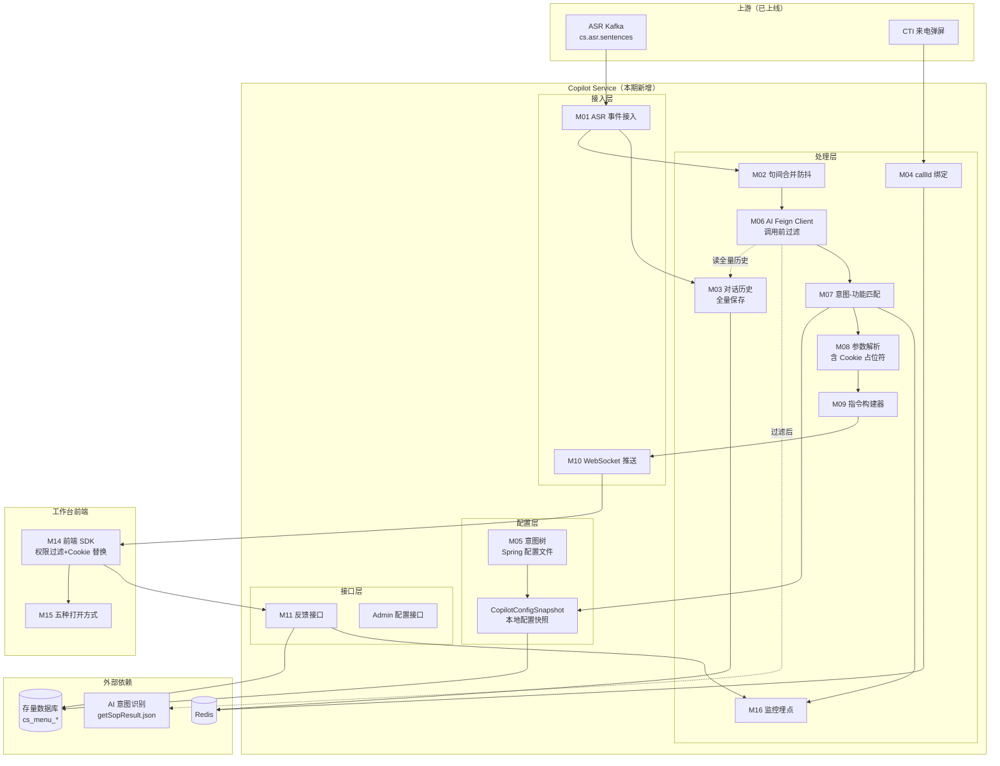
```mermaid
graph TB
    subgraph 上游["上游（已上线）"]
        ASR[ASR Kafka<br/>cs.asr.sentences]
        CTI[CTI 来电弹屏]
    end

    subgraph CopilotService["Copilot Service（本期新增）"]
        subgraph 接入["接入层"]
            M01[M01 ASR 事件接入]
            M10[M10 WebSocket 推送]
        end
        subgraph 处理["处理层"]
            M02[M02 句间合并防抖]
            M03[M03 对话历史<br/>全量保存]
            M04[M04 callId 绑定]
            M06[M06 AI Feign Client<br/>调用前过滤]
            M07[M07 意图-功能匹配]
            M08[M08 参数解析<br/>含 Cookie 占位符]
            M09[M09 指令构建器]
            M16[M16 监控埋点]
        end
        subgraph 配置["配置层"]
            M05[M05 意图树<br/>Spring 配置文件]
            CACHE[CopilotConfigSnapshot<br/>本地配置快照]
        end
        subgraph 接口["接口层"]
            M11[M11 反馈接口]
            ADMIN[Admin 配置接口]
        end
    end

    subgraph External["外部依赖"]
        AI[AI 意图识别<br/>getSopResult.json]
        DB[(存量数据库<br/>cs_menu_*)]
        REDIS[(Redis)]
    end

    subgraph Frontend["工作台前端"]
        SDK[M14 前端 SDK<br/>权限过滤+Cookie 替换]
        OPEN[M15 五种打开方式]
    end

    ASR --> M01
    CTI --> M04
    M01 --> M02
    M01 --> M03
    M02 --> M06
    M06 -.读全量历史.-> M03
    M06 -.过滤后.-> AI
    M06 --> M07
    M07 --> CACHE
    M07 --> M08
    M08 --> M09
    M09 --> M10
    M10 --> SDK
    SDK --> OPEN
    M03 --> REDIS
    M04 --> REDIS
    M05 --> CACHE
    CACHE --> DB
    SDK --> M11
    M11 --> DB
    M11 --> M16
    M07 --> M16
```

### 5.2 部署视图

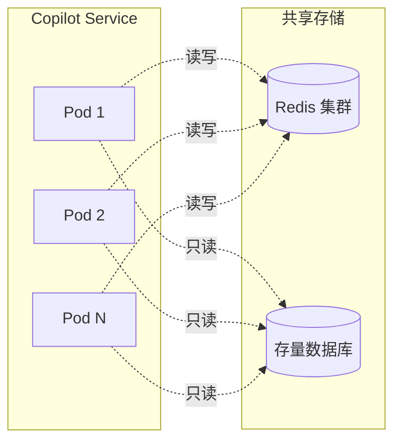
```mermaid
graph LR
    subgraph "Copilot Service"
        P1[Pod 1]
        P2[Pod 2]
        P3[Pod N]
    end
    subgraph 共享存储
        REDIS[(Redis 集群)]
        DB[(存量数据库)]
    end

    P1 -.->|读写| REDIS
    P2 -.->|读写| REDIS
    P3 -.->|读写| REDIS
    P1 -.->|只读| DB
    P2 -.->|只读| DB
    P3 -.->|只读| DB
```

设计要点：

- Copilot Service 无状态，支持水平扩展
- 内存缓存 CopilotConfigSnapshot，通过 Admin 接口触发刷新，并通过版本轮询兜底
- ASR 消息按 `callId` 哈希分区，保证同通话路由到同一 Pod（防抖 timer 一致性）
- Redis 维护通话级状态（对话历史、callSession、静默列表）

---

## 6. 模块职责划分

### 6.1 后端模块职责矩阵

| 模块 | 职责 | 输入 | 输出 |
|------|------|------|------|
| M01 ASR 事件接入器 | Kafka 消费 + 去重 | Kafka 消息 | 内部事件 |
| M02 句间合并器 | 防抖 + 沉默判定 | ASR 事件 | 触发意图查询信号 |
| M03 对话历史管理 | **全量保存** 客户+坐席 | ASR 事件 | List<DialogMessage> |
| M04 callId 绑定 | 通话级会话上下文 | CTI 弹屏事件 | CallSession |
| M05 意图树加载器 | 启动时从配置文件加载 | Spring Resource | IntentTree 内存对象 |
| M06 AI Feign Client | Feign 调用 + **调用前过滤** | history+intentTree | IntentResult |
| M07 意图-功能匹配 | CopilotConfigSnapshot 反向索引查询 | intentCode | List<ItemCandidate> |
| M08 参数解析器 | 上下文取值 + Cookie 占位符标记 | paramList + ctx | ResolvedParams |
| M09 指令构建器 | URL 拼接（含占位符）+ actionType 派生 | candidate + params | DirectiveDTO |
| M10 WebSocket 推送 | 推送指令到前端 | DirectiveDTO | 前端 push |
| M11 反馈接口 | 反馈采集 + 持久化 + 静默 | FeedbackDTO | DB |
| M16 业务监控埋点 | 触发/反馈日志落库 | 业务事件 | DB |

### 6.2 前端模块职责矩阵

| 子模块 | 职责 |
|--------|------|
| M14-1 WebSocket 客户端 | 接收指令，路由处理 |
| M14-2 浮窗 UI | 展示推荐卡片、状态提示 |
| M14-3 推荐卡片组件 | 展示意图、功能、确认按钮 |
| M14-4 权限过滤 | **基于工作台已有权限体系，过滤无权功能不展示** |
| M14-5 Cookie 占位符替换 | 把指令中 `${COOKIE.xxx}` 替换为实际 cookie 值 |
| M14-6 反馈上报 | 4 种反馈类型上报 |
| M15 五种打开方式 | URL/路由/组件/iframe/新窗口 |

---

## 7. 数据流

### 7.1 核心数据流

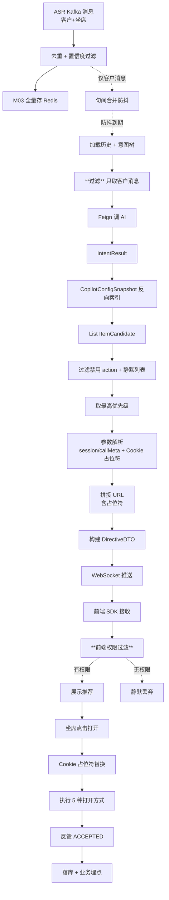
```mermaid
flowchart TD
    A[ASR Kafka 消息<br/>客户+坐席] --> B[去重 + 置信度过滤]
    B --> C[M03 全量存 Redis]
    B -.仅客户消息.-> D[句间合并防抖]
    D -.防抖到期.-> E[加载历史 + 意图树]
    E --> F[**过滤** 只取客户消息]
    F --> G[Feign 调 AI]
    G --> H[IntentResult]
    H --> I[CopilotConfigSnapshot 反向索引]
    I --> J[List ItemCandidate]
    J --> K[过滤禁用 action + 静默列表]
    K --> L[取最高优先级]
    L --> M[参数解析<br/>session/callMeta + Cookie 占位符]
    M --> N[拼接 URL<br/>含占位符]
    N --> O[构建 DirectiveDTO]
    O --> P[WebSocket 推送]
    P --> Q[前端 SDK 接收]
    Q --> R[**前端权限过滤**]
    R -.有权限.-> S[展示推荐]
    R -.无权限.-> X[静默丢弃]
    S --> T[坐席点击打开]
    T --> U[Cookie 占位符替换]
    U --> V[执行 5 种打开方式]
    V --> W[反馈 ACCEPTED]
    W --> Y[落库 + 业务埋点]
```

### 7.2 配置数据流（Copilot 独立配置）


```mermaid
flowchart LR
    A[配置后台编辑] --> B[活表数据]
    B --> C[运营点击发布 Copilot 配置]
    C --> D[Copilot 配置发布服务 M12]
    D --> E[读 action + mapping + 可选菜单项]
    E --> F[action/mapping/item 校验]
    F --> G[写 cs_copilot_config_version]
    G --> H[Admin 触发 Copilot 刷新]
    H --> I[内存 CopilotConfigSnapshot + 反向索引]
```

### 7.3 会话保存与过滤分开（DD-V1.1 关键设计）

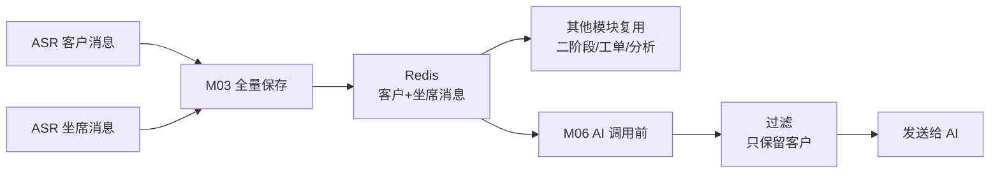
```mermaid
flowchart LR
    A[ASR 客户消息] --> M03[M03 全量保存]
    B[ASR 坐席消息] --> M03
    M03 --> R[Redis<br/>客户+坐席消息]
    R --> X[其他模块复用<br/>二阶段/工单/分析]
    R --> M06[M06 AI 调用前]
    M06 --> F[过滤<br/>只保留客户]
    F --> AI[发送给 AI]
```

设计要点：

| 关注点 | 处理 |
|--------|------|
| 保存范围 | 客户 + 坐席消息 **全量** 存 Redis |
| 复用场景 | 其他模块（二阶段、工单系统、运营分析）需要完整对话 |
| 调 AI 时 | M06 在调用前过滤，**只传 `speakerRole=CUSTOMER` 的消息** |
| 实现位置 | 保存逻辑在 M03，过滤逻辑在 M06，**两者独立** |

---
# 第三篇 核心模块详细设计

> **代码风格说明**：保留必要伪代码，关键逻辑用 Mermaid 图辅助说明。

## 8. ASR 接入与处理（M01）

### 8.1 输入事件格式

```json
{
  "callId": "CALL_202604240001",
  "sentenceId": "ASR_SEG_10086",
  "speakerRole": "CUSTOMER",
  "speakerId": "ho212121",
  "content": "我下周要去日本旅游需要做行程报备",
  "beginTime": "2026-04-24T10:01:01",
  "endTime": "2026-04-24T10:01:04",
  "confidence": 0.94
}
```

### 8.2 处理流程（DD-V1.2 调整 P0-7）

> **关键修订**：先存历史再做触发判断，落实 M03"全量保存"语义。
> 原 DD-V1.1 在 isValid 阶段就过滤短句/低置信度，导致部分消息未保存到历史。

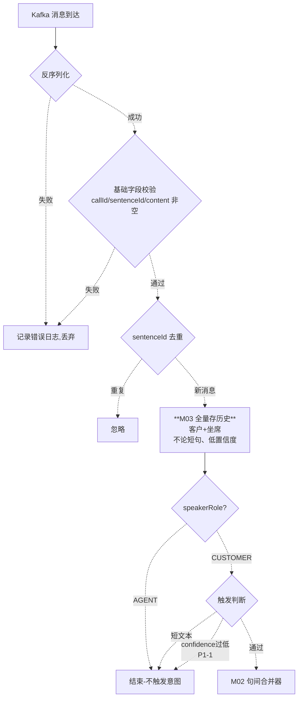
```mermaid
flowchart TD
    A[Kafka 消息到达] --> B{反序列化}
    B -.失败.-> ERR1[记录错误日志,丢弃]
    B -.成功.-> C{基础字段校验<br/>callId/sentenceId/content 非空}
    C -.失败.-> ERR1
    C -.通过.-> D{sentenceId 去重}
    D -.重复.-> SKIP[忽略]
    D -.新消息.-> E[**M03 全量存历史**<br/>客户+坐席<br/>不论短句、低置信度]
    E --> F{speakerRole?}
    F -.AGENT.-> H[结束-不触发意图]
    F -.CUSTOMER.-> G{触发判断}
    G -.短文本.-> H
    G -.confidence过低<br/>P1-1.-> H
    G -.通过.-> I[M02 句间合并器]
```

**两层过滤分离**：

| 层 | 作用 | 过滤条件 |
|----|------|---------|
| 第 1 层（基础校验） | 决定是否进入系统 | 反序列化成功、关键字段非空、sentenceId 未重复 |
| **保存层** | M03 全量保存 | 通过基础校验的所有消息（无论客户/坐席/短句/低置信） |
| 第 2 层（触发判断） | 决定是否触发意图识别 | speakerRole=CUSTOMER + 文本长度 + confidence |

### 8.3 Kafka Consumer 配置

```yaml
spring:
  kafka:
    bootstrap-servers: ${KAFKA_BROKERS}
    consumer:
      group-id: copilot-asr-consumer
      auto-offset-reset: latest
      enable-auto-commit: false
      max-poll-records: 50

copilot:
  asr:
    topic: cs.asr.sentences
    concurrency: 4
    min-text-length: 4
    asr-confidence-threshold: 0.65
```

### 8.4 关键代码骨架（DD-V1.2 调整）

```java
@Component
public class AsrSentenceConsumer {

    @Autowired private SentenceDedupService dedupService;
    @Autowired private DialogHistoryManager historyManager;
    @Autowired private SentenceMerger sentenceMerger;

    @KafkaListener(topics = "${copilot.asr.topic}",
                   concurrency = "${copilot.asr.concurrency}")
    public void consume(ConsumerRecord<String, String> record,
                        Acknowledgment ack) {
        try {
            AsrSentenceEvent event = JSON.parseObject(record.value(),
                AsrSentenceEvent.class);

            // 1. 基础字段校验
            if (!basicValid(event)) {
                ack.acknowledge();
                return;
            }

            // 2. sentenceId 去重
            if (dedupService.isDuplicate(event.getSentenceId())) {
                ack.acknowledge();
                return;
            }

            // 3. 【DD-V1.2 P0-7】先全量保存历史（客户+坐席，不论短句/低置信度）
            historyManager.append(event);

            // 4. 触发判断：只有客户消息进入后续流程
            if (!"CUSTOMER".equals(event.getSpeakerRole())) {
                ack.acknowledge();
                return;
            }

            // 5. 客户消息：再做触发过滤
            if (!triggerValid(event)) {
                ack.acknowledge();
                return;
            }

            sentenceMerger.handleSentence(event);
            ack.acknowledge();
        } catch (Exception e) {
            log.error("Process ASR event failed: {}", record.value(), e);
            ack.acknowledge();
        }
    }

    /**
     * 基础校验：决定是否进入系统（保存历史）
     */
    private boolean basicValid(AsrSentenceEvent event) {
        return event.getCallId() != null
            && event.getSentenceId() != null
            && event.getContent() != null;
    }

    /**
     * 触发校验：决定是否触发意图识别
     * DD-V1.2 P1-1：confidence 缺失（NPE 防护）按中低置信度处理
     */
    private boolean triggerValid(AsrSentenceEvent event) {
        if (event.getContent().length() < MIN_TEXT_LENGTH) {
            return false;
        }
        // P1-1：confidence 可能为 null
        Float confidence = event.getConfidence();
        if (confidence == null) {
            return ASR_CONFIDENCE_DEFAULT_PASS;  // 配置项：默认通过/不通过
        }
        return confidence >= ASR_CONFIDENCE_THRESHOLD;
    }
}
```

---

## 9. 句间合并器（M02）

### 9.1 设计目标

ASR 上游已合并基础句子，Copilot 侧的处理是**判断多句是否需要合并为一次意图查询**。

### 9.2 句子连续性判定状态图

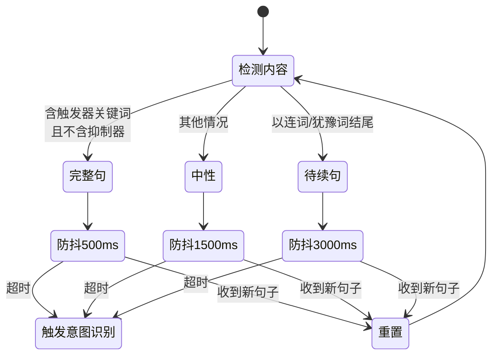
```mermaid
stateDiagram-v2
    [*] --> 检测内容
    检测内容 --> 完整句: 含触发器关键词<br/>且不含抑制器
    检测内容 --> 待续句: 以连词/犹豫词结尾
    检测内容 --> 中性: 其他情况

    完整句 --> 防抖500ms
    中性 --> 防抖1500ms
    待续句 --> 防抖3000ms

    防抖500ms --> 触发意图识别: 超时
    防抖1500ms --> 触发意图识别: 超时
    防抖3000ms --> 触发意图识别: 超时

    防抖500ms --> 重置: 收到新句子
    防抖1500ms --> 重置: 收到新句子
    防抖3000ms --> 重置: 收到新句子
    重置 --> 检测内容
```

### 9.3 触发器与抑制器词典

| 类型 | 关键词举例 |
|------|-----------|
| 触发器（业务动词） | 查询、办理、申请、挂失、修改、取消、激活、还款 |
| 触发器（领域名词） | 账单、卡片、分期、额度、积分、年费 |
| 触发器（问句结构） | 怎么、能不能、可以...吗、多少、什么时候 |
| 抑制器（连词） | 就是、然后、因为、所以、但是 |
| 抑制器（犹豫词） | 呃、那个、就、嗯 |
| 抑制器（未完成短语） | 上个月、那笔、就那个 |

### 9.4 沉默兜底机制

```
独立 silenceTimer，与防抖 timer 并行：
  - 每条新消息到达时重置（2000ms）
  - 沉默 2 秒未收到新句子 → 立即触发意图识别
  - 已触发后再有新句子，开始新一轮防抖
```

### 9.5 关键代码骨架

```java
@Component
public class SentenceMerger {

    private final Map<String, ScheduledFuture<?>> debounceTimers = new ConcurrentHashMap<>();
    private final Map<String, ScheduledFuture<?>> silenceTimers = new ConcurrentHashMap<>();

    @Autowired private ScheduledExecutorService scheduler;
    @Autowired private IntentRecognitionTrigger trigger;

    public void handleSentence(AsrSentenceEvent event) {
        String callId = event.getCallId();
        SentenceContinuity continuity = detect(event.getContent());
        long debounceMs = mapDebounceMs(continuity);

        cancelTimer(debounceTimers.remove(callId));
        debounceTimers.put(callId, scheduler.schedule(
            () -> trigger.fire(callId), debounceMs, TimeUnit.MILLISECONDS));

        cancelTimer(silenceTimers.remove(callId));
        silenceTimers.put(callId, scheduler.schedule(
            () -> trigger.fire(callId), 2000, TimeUnit.MILLISECONDS));
    }

    public void cleanup(String callId) {
        cancelTimer(debounceTimers.remove(callId));
        cancelTimer(silenceTimers.remove(callId));
    }
}
```

### 9.6 多 Pod 一致性

```
问题：单通话的 ASR 消息可能分发到不同 Pod，防抖 timer 在多 Pod 各自计时

MVP 方案：Kafka Topic 按 callId 哈希分区
  - 同一 callId 的消息固定路由到同一分区 → 同一 Pod
  - 配置：Topic 分区数 ≥ Pod 数 × 2

后续优化（待实现）：Redis 分布式锁 + 全局防抖 timer
```

---

## 10. 对话历史维护（M03）— 全量保存

### 10.1 数据结构

```java
public class DialogMessage {
    private String id;            // 来自 sentenceId
    private String role;          // user / assistant
    private String content;       // 原文
    private String contentType;   // 固定 "text"
    private String createTime;    // YYYY-MM-DD HH:mm:ss
    private String speakerRole;   // CUSTOMER / AGENT（DD-V1.1 新增，便于过滤）
}
```

### 10.2 存储设计

```
存储：Redis List
Key:   copilot:history:{callId}
Value: List<DialogMessage> 序列化 JSON
TTL:   通话结束 + 1 小时（兜底）
最大长度：50 条
```

### 10.3 关键设计：保存全量，过滤在调用 AI 时（DD-V1.1）

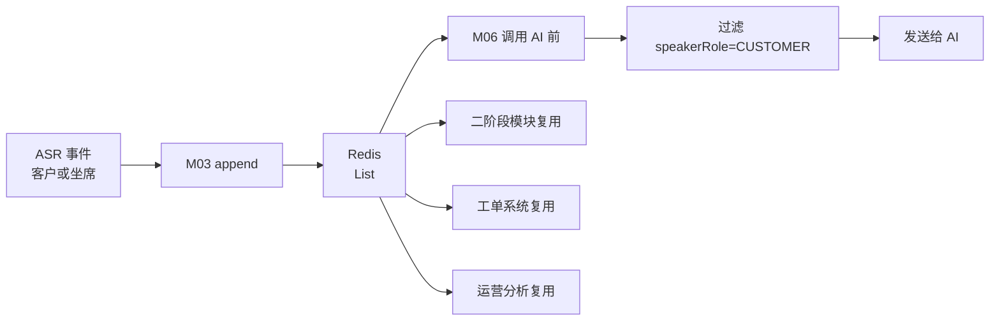
```mermaid
flowchart LR
    A[ASR 事件<br/>客户或坐席] --> M03[M03 append]
    M03 --> Redis[Redis<br/>List<DialogMessage>]
    Redis --> M06[M06 调用 AI 前]
    Redis --> F1[二阶段模块复用]
    Redis --> F2[工单系统复用]
    Redis --> F3[运营分析复用]
    M06 --> Filter[过滤 speakerRole=CUSTOMER]
    Filter --> AI[发送给 AI]
```

### 10.4 关键代码骨架

```java
@Component
public class DialogHistoryManager {

    @Autowired private RedisTemplate<String, String> redisTemplate;

    private static final int MAX_HISTORY = 50;
    private static final Duration TTL = Duration.ofHours(1);

    /**
     * 保存所有 ASR 事件（客户 + 坐席都存）
     */
    public void append(AsrSentenceEvent event) {
        String key = key(event.getCallId());
        DialogMessage msg = toDialogMessage(event);
        redisTemplate.opsForList().rightPush(key, JSON.toJSONString(msg));
        redisTemplate.opsForList().trim(key, -MAX_HISTORY, -1);
        redisTemplate.expire(key, TTL);
    }

    /**
     * 取全量历史（客户 + 坐席）— 供 M06 调用
     * 过滤逻辑在 M06 中实现，本方法不过滤
     */
    public List<DialogMessage> getHistory(String callId) {
        List<String> rawList = redisTemplate.opsForList().range(key(callId), 0, -1);
        if (rawList == null) return Collections.emptyList();
        return rawList.stream()
            .map(s -> JSON.parseObject(s, DialogMessage.class))
            .collect(Collectors.toList());
    }

    public void cleanup(String callId) {
        redisTemplate.delete(key(callId));
    }

    private DialogMessage toDialogMessage(AsrSentenceEvent event) {
        return DialogMessage.builder()
            .id(event.getSentenceId())
            .role("CUSTOMER".equals(event.getSpeakerRole()) ? "user" : "assistant")
            .speakerRole(event.getSpeakerRole())  // 保留原值便于过滤
            .content(event.getContent())
            .contentType("text")
            .createTime(formatTime(event.getBeginTime()))
            .build();
    }

    private String key(String callId) {
        return "copilot:history:" + callId;
    }
}
```

### 10.5 简化说明

```
本期不做（按你的指示）：
  ✗ 敏感字段脱敏（证件号/手机号/卡号 mask）
  ✗ Redis 加密存储
  ✗ 90 天加密审计日志
  ✗ 访问审计

理由：
  - 调用行内大模型和接口，不外传
  - Redis 1 小时过期自动清理
  - 后续根据行内合规要求适配
```

---

## 11. callId-operatorId 绑定（M04）

### 11.1 必要性

ASR 消息的 `speakerId` 仅在坐席说话时有值。客户句子触发意图识别时需要 operatorId 用于：

- WebSocket 推送目标
- 反馈日志记录
- 监控埋点

> 注：DD-V1.1 删除服务端权限校验后，operatorId 不再用于权限判断

### 11.2 数据结构

```
Redis Hash
Key:   copilot:call_session:{callId}
Fields:
  operatorId          坐席工号
  customerId          客户号（来电弹屏获取）
  customerType        客户类型（VIP3/Normal 等）
  sessionStartTime    通话开始时间
TTL: 通话结束 + 30 分钟
```

### 11.3 绑定时机

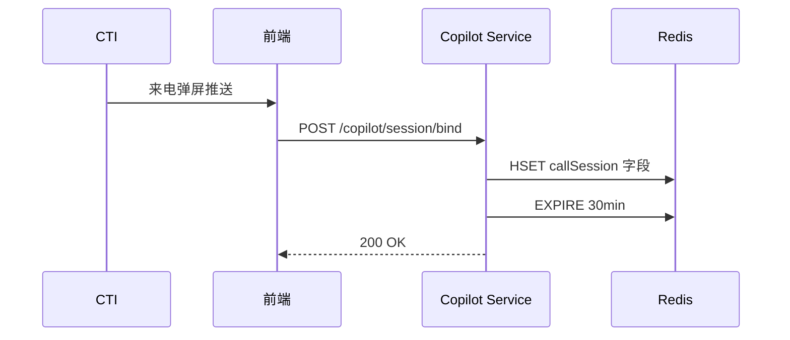
```mermaid
sequenceDiagram
    participant CTI
    participant FE as 前端
    participant SVC as Copilot Service
    participant Redis

    CTI->>FE: 来电弹屏推送
    FE->>SVC: POST /copilot/session/bind
    SVC->>Redis: HSET callSession 字段
    SVC->>Redis: EXPIRE 30min
    SVC-->>FE: 200 OK
```

### 11.4 关键代码骨架

```java
@Component
public class CallSessionManager {

    @Autowired private RedisTemplate<String, String> redisTemplate;

    public void bind(CallSessionDTO session) {
        String key = key(session.getCallId());
        Map<String, String> fields = Map.of(
            "operatorId", session.getOperatorId(),
            "customerId", session.getCustomerId(),
            "customerType", session.getCustomerType(),
            "sessionStartTime", String.valueOf(System.currentTimeMillis())
        );
        redisTemplate.opsForHash().putAll(key, fields);
        redisTemplate.expire(key, Duration.ofMinutes(30));
    }

    public CallSessionDTO get(String callId) {
        Map<Object, Object> fields = redisTemplate.opsForHash().entries(key(callId));
        if (fields.isEmpty()) return null;
        return CallSessionDTO.fromMap(fields);
    }

    public void cleanup(String callId) {
        redisTemplate.delete(key(callId));
    }
}
```

### 11.5 fail closed 策略（DD-V1.2 调整 P0-8）

> **关键修订**：DD-V1.1 中"用空 operatorId 继续推荐"会导致：
> - WebSocket 推送目标不明（推不到坐席）
> - 反馈日志归因失败
> - 串话风险（推送到错误坐席）
>
> DD-V1.2 改为 fail closed：未绑定时不推荐。

```
查询时未找到绑定：
  1. 兜底查找：从最近 ASR 消息中找 speakerRole=AGENT 且 speakerId 非空的
  2. 仍找不到 → 不触发推荐，记录 trigger_log
       - result_status = FAIL
       - reason_code = SESSION_BIND_MISSING
  3. 监控指标 copilot.session.missing 用于排查

前端可选体验：
  侧边栏显示"Copilot 未绑定当前通话"，但绝不生成跳转指令。
```

#### 调用方校验

匹配引擎、指令构建器、推送等所有依赖 operatorId 的模块在入口处都应做防御性校验：

```java
public void doRecommend(String callId, String intentCode) {
    CallSession session = callSessionManager.get(callId);
    if (session == null || StringUtils.isEmpty(session.getOperatorId())) {
        // P0-8 fail closed
        triggerLogService.logFailure(callId, intentCode,
            ResultStatus.FAIL, ReasonCode.SESSION_BIND_MISSING);
        return;
    }
    // 继续推荐流程
}
```

---

## 12. 意图树管理（M05）

### 12.1 加载方式

按你的指示，意图树前期就传固定值，**放 Spring 配置文件**，不存表。

```yaml
copilot:
  intent-tree:
    file: classpath:intent-tree.json
    version: TREE_FIXED_V1
```

```json
// resources/intent-tree.json
{
  "intentName": "ROOT",
  "intentCode": "ROOT",
  "children": [
    {
      "intentName": "账务查询",
      "intentCode": "BILL_QUERY_DOMAIN",
      "children": [
        {
          "intentName": "账单查询",
          "intentCode": "INTENT_BILL_QUERY",
          "parentIntentCode": "BILL_QUERY_DOMAIN"
        }
      ]
    }
  ]
}
```

### 12.2 加载器

```java
@Component
public class IntentTreeLoader {

    @Value("${copilot.intent-tree.file}")
    private Resource intentTreeFile;

    @Value("${copilot.intent-tree.version}")
    private String version;

    private volatile IntentTreeNode cachedTree;

    @PostConstruct
    public void load() {
        try (InputStream is = intentTreeFile.getInputStream()) {
            String content = new String(is.readAllBytes(), StandardCharsets.UTF_8);
            cachedTree = JSON.parseObject(content, IntentTreeNode.class);
            log.info("Loaded intent tree, version={}", version);
        } catch (IOException e) {
            throw new IllegalStateException("Load intent tree failed", e);
        }
    }

    public IntentTreeNode getTree() { return cachedTree; }
    public String getVersion() { return version; }
}
```

### 12.3 热加载接口（DD-V1.2 新增 P1-7）

> 配置文件方式无需重启服务即可更新意图树，提供 Admin 接口触发重新加载。

```java
@PostMapping("/copilot/admin/intent-tree/reload")
public AdminResult reloadIntentTree() {
    intentTreeLoader.load();
    return AdminResult.builder()
        .currentVersion(intentTreeLoader.getVersion())
        .nodeCount(intentTreeLoader.getNodeCount())
        .reloadTime(Instant.now())
        .build();
}
```

**使用方式**：
1. 运维人员替换 `intent-tree.json` 配置文件
2. 调用 `POST /copilot/admin/intent-tree/reload`
3. 当前 Pod 重新加载内存中的意图树
4. 多 Pod 场景：每个 Pod 都需调用一次（或配合 P1-17 轮询机制）

### 12.4 后续扩展点

```
本期：Spring 配置文件 + 热加载接口
后续：可平滑切换为数据库表 + 一键发布（详见 F12）

切换路径：
  - 增加 IntentTreeLoader 的实现类（如 DatabaseIntentTreeLoader）
  - 通过 @ConditionalOnProperty 控制启用
  - 业务代码不变
```

---

## 13. AI 意图识别对接（M06）— Feign + 过滤

> DD-V1.1 关键调整：从 RestTemplate 改为 Spring Cloud OpenFeign Client，调用前过滤只传客户消息。

### 13.1 接口规范

```
POST http://aicscopilotreplygensop.sk.aipower3.cmbchina.cn/AICSCopilotReplyGen/getSopResult.json
Content-Type: application/json
```

### 13.2 Feign Client 定义

```java
@FeignClient(
    name = "ai-intent-client",
    url = "${copilot.ai.url}",
    configuration = AiFeignConfig.class
)
public interface AiIntentFeignClient {

    @PostMapping(value = "/AICSCopilotReplyGen/getSopResult.json",
                 consumes = MediaType.APPLICATION_JSON_VALUE)
    IntentRecognitionResponse recognize(@RequestBody IntentRecognitionRequest request);
}
```

### 13.3 Feign 配置（DD-V1.2 调整：增加熔断 P1-5）

```java
@Configuration
public class AiFeignConfig {

    @Bean
    public Request.Options aiRequestOptions(
            @Value("${copilot.ai.connect-timeout-ms:1000}") int connectTimeout,
            @Value("${copilot.ai.read-timeout-ms:3000}") int readTimeout) {
        return new Request.Options(
            connectTimeout, TimeUnit.MILLISECONDS,
            readTimeout, TimeUnit.MILLISECONDS,
            true);
    }

    @Bean
    public Logger.Level feignLoggerLevel() {
        return Logger.Level.BASIC;
    }

    @Bean
    public ErrorDecoder aiErrorDecoder() {
        return new AiErrorDecoder();
    }
}
```

#### 熔断保护（DD-V1.2 新增 P1-5）

> 用 Resilience4j CircuitBreaker 保护 AI 接口。**不做限流和 Bulkhead**（5 TPS 量级不必要）。

```yaml
resilience4j:
  circuitbreaker:
    instances:
      aiIntentClient:
        # 滑动窗口
        slidingWindowSize: 50
        # 失败率阈值
        failureRateThreshold: 50
        # 慢调用阈值
        slowCallDurationThreshold: 3s
        slowCallRateThreshold: 80
        # 半开状态请求数
        permittedNumberOfCallsInHalfOpenState: 3
        # 等待时长
        waitDurationInOpenState: 30s
        # 监控异常
        recordExceptions:
          - feign.RetryableException
          - feign.FeignException

copilot:
  ai:
    url: http://aicscopilotreplygensop.sk.aipower3.cmbchina.cn
    connect-timeout-ms: 1000
    read-timeout-ms: 3000
```

```java
@Component
public class IntentRecognitionClient {

    @CircuitBreaker(name = "aiIntentClient", fallbackMethod = "fallback")
    public IntentResult recognize(String callId) {
        // 正常调用逻辑
    }

    private IntentResult fallback(String callId, Throwable t) {
        log.warn("AI circuit breaker open: callId={}", callId);
        metricsService.recordAiCircuitBreakerOpen();
        // 前端展示"AI 不可用"灰态
        return null;
    }
}
```

#### 单通话 AI 调用计数（DD-V1.2 新增 P1-4）

> 防止单通话超频调用 AI（恶意或异常）。

```java
public IntentResult recognize(String callId) {
    String key = "copilot:ai_count:" + callId;
    Long count = redisTemplate.opsForValue().increment(key);
    if (count == 1L) {
        redisTemplate.expire(key, Duration.ofHours(2));
    }
    if (count > maxAiCallsPerCall) {
        triggerLogService.logFailure(callId, null,
            ResultStatus.FAIL, ReasonCode.AI_CALL_LIMIT_EXCEEDED);
        return null;
    }
    // 继续调用
}
```

```yaml
copilot:
  call-limits:
    max-ai-calls-per-call: 50
```

### 13.4 调用前过滤（核心设计）

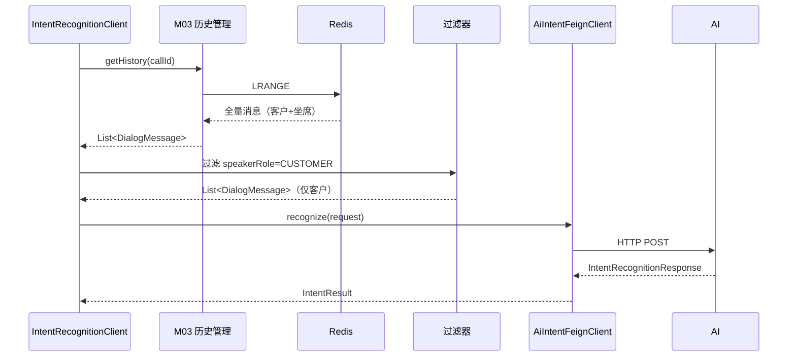
```mermaid
sequenceDiagram
    participant Client as IntentRecognitionClient
    participant History as M03 历史管理
    participant Redis
    participant Filter as 过滤器
    participant Feign as AiIntentFeignClient
    participant AI

    Client->>History: getHistory(callId)
    History->>Redis: LRANGE
    Redis-->>History: 全量消息（客户+坐席）
    History-->>Client: List<DialogMessage>
    Client->>Filter: 过滤 speakerRole=CUSTOMER
    Filter-->>Client: List<DialogMessage>（仅客户）
    Client->>Feign: recognize(request)
    Feign->>AI: HTTP POST
    AI-->>Feign: IntentRecognitionResponse
    Feign-->>Client: IntentResult
```

### 13.5 调用层（业务封装）

```java
@Component
public class IntentRecognitionClient {

    @Autowired private AiIntentFeignClient feignClient;
    @Autowired private DialogHistoryManager historyManager;
    @Autowired private IntentTreeLoader treeLoader;
    @Autowired private ExecutedStepsManager stepsManager;

    public IntentResult recognize(String callId) {
        // 1. 取全量历史（客户+坐席）
        List<DialogMessage> fullHistory = historyManager.getHistory(callId);
        if (fullHistory.isEmpty()) return null;

        // 2. 过滤只保留客户消息（DD-V1.1 关键设计）
        List<DialogMessage> customerOnly = fullHistory.stream()
            .filter(m -> "CUSTOMER".equals(m.getSpeakerRole()))
            .collect(Collectors.toList());

        if (customerOnly.isEmpty()) return null;

        // 3. 构建请求
        IntentRecognitionRequest request = IntentRecognitionRequest.builder()
            .sessionId(callId)
            .requestId(generateRequestId())
            .history(customerOnly)
            .executedSteps(stepsManager.getSteps(callId))
            .intentTree(treeLoader.getTree())
            .treeVersion(treeLoader.getVersion())
            .build();

        // 4. Feign 调用
        try {
            IntentRecognitionResponse response = feignClient.recognize(request);
            return parseResponse(response);
        } catch (FeignException e) {
            log.warn("AI intent recognition failed: callId={}, status={}",
                callId, e.status(), e);
            metricsService.recordAiFailure();
            return null;  // 静默失败
        }
    }
}
```

### 13.6 响应字段处理

| 字段 | 是否使用 | 说明 |
|------|---------|------|
| `data.intentCode` | ✅ 使用 | 当前识别的意图代码 |
| `data.intentName` | ✅ 使用 | 当前识别的意图名称 |
| `data.clarifyContent` | ❌ 不使用 | 澄清功能本期不做 |
| `data.llmResults` | ❌ 不使用 | SOP 决策本期不做 |

### 13.7 executedSteps 维护

仅在 ACCEPTED 反馈时追加，作为 AI 后续决策的辅助信号。

```java
@Component
public class ExecutedStepsManager {

    @Autowired private RedisTemplate<String, String> redisTemplate;

    public void appendStep(String callId, String intentCode, String intentName) {
        String key = "copilot:steps:" + callId;
        ExecutedStep step = new ExecutedStep(intentCode, intentName,
            System.currentTimeMillis());
        redisTemplate.opsForList().rightPush(key, JSON.toJSONString(step));
        redisTemplate.expire(key, Duration.ofHours(1));
    }

    public List<ExecutedStep> getSteps(String callId) {
        List<String> raw = redisTemplate.opsForList()
            .range("copilot:steps:" + callId, 0, -1);
        if (raw == null) return Collections.emptyList();
        return raw.stream().map(s -> JSON.parseObject(s, ExecutedStep.class)).toList();
    }

    public void cleanup(String callId) {
        redisTemplate.delete("copilot:steps:" + callId);
    }
}
```

---

## 14. 意图-功能匹配（M07）

### 14.1 匹配流程

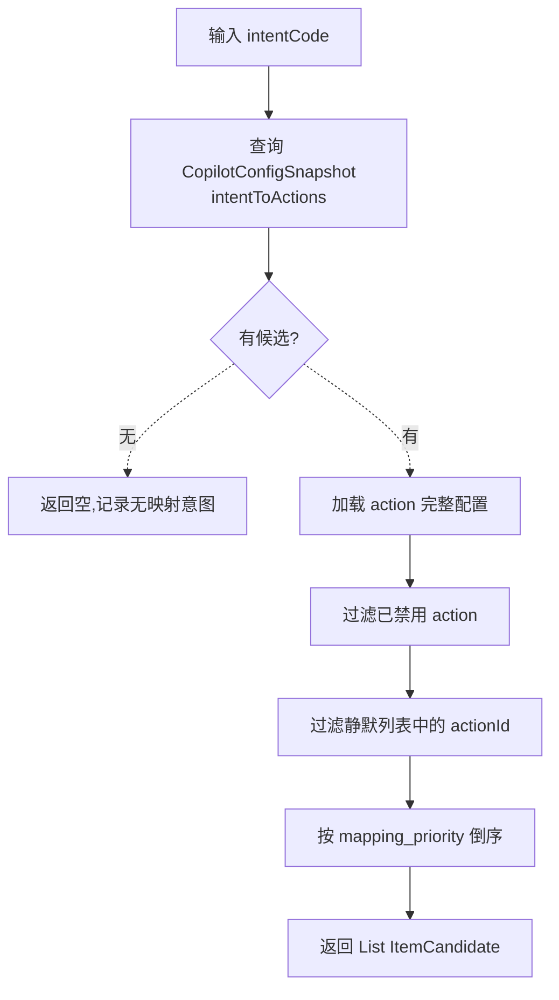
```mermaid
flowchart TD
    A[输入 intentCode] --> B[查询 CopilotConfigSnapshot<br/>intentToActions]
    B --> C{有候选?}
    C -.无.-> X[返回空,记录无映射意图]
    C -.有.-> D[加载 action 完整配置]
    D --> E[过滤已禁用 action]
    E --> F[过滤静默列表中的 actionId]
    F --> G[按 mapping_priority 倒序]
    G --> H[返回 List ItemCandidate]
```

### 14.2 数据加载

```java
@Component
public class CopilotConfigCache {

    @Autowired private CopilotConfigRepository configRepository;
    private volatile CopilotConfigSnapshot currentSnapshot;

    @PostConstruct
    public void init() {
        loadLatestVersion();
    }

    /**
     * 由 Admin 接口触发刷新，也由版本轮询兜底触发
     */
    public void loadLatestVersion() {
        CopilotConfigSnapshot snapshot = configRepository.loadLatestSnapshot();
        validateConfig(snapshot);
        this.currentSnapshot = snapshot;
        log.info("Loaded copilot config version: {}", snapshot.getVersionId());
    }

    public List<ActionReference> findCandidatesByIntent(String intentCode) {
        if (currentSnapshot == null) return Collections.emptyList();
        return currentSnapshot.getIntentToActions()
            .getOrDefault(intentCode, Collections.emptyList());
    }

    public CopilotActionConfig getActionConfig(String actionId) {
        if (currentSnapshot == null) return null;
        return currentSnapshot.getActionById().get(actionId);
    }
}
```

### 14.3 条件规则说明

本期删除 `condition_rule`、`EvaluationContext`、`JsonRuleEvaluator`。意图到 action 的候选关系只由 `cs_copilot_intent_mapping` 和 `mapping_priority` 决定，避免在 MVP 阶段引入不可视、难验证的规则表达式。

如果后续需要“仅当客户等级/业务状态满足条件时推荐”，应单独设计规则引擎能力，并补充字段白名单、表达式复杂度限制、发布前沙箱测试和 Bad Case 追踪。

### 14.5 灰度白名单（DD-V1.2 新增 P1-9）

> **最简灰度方案**：仅按 operatorId 列表过滤，不做完整 GrayPolicy 框架（属于 F07）。

```yaml
copilot:
  gray:
    enabled: true
    # 仅这些坐席能收到 Copilot 推荐
    operator-whitelist:
      - ho212121
      - ho212122
      - ho212123
```

```java
@Component
public class GrayWhitelistFilter {
    
    @Value("${copilot.gray.enabled:true}")
    private boolean enabled;
    
    @Value("#{'${copilot.gray.operator-whitelist:}'.split(',')}")
    private Set<String> operatorWhitelist;
    
    public boolean isOperatorEnabled(String operatorId) {
        if (!enabled) return true;  // 开关关闭则全放行
        if (operatorWhitelist.isEmpty()) return true;
        return operatorWhitelist.contains(operatorId);
    }
}
```

调用：

```java
// 在匹配引擎或推送前调用
if (!grayWhitelistFilter.isOperatorEnabled(operatorId)) {
    triggerLogService.logFailure(callId, intentCode,
        ResultStatus.FAIL, ReasonCode.GRAY_FILTERED);
    return;
}
```

**配置变更**：白名单通过 Spring Cloud 配置中心或 application.yml 修改，热加载（无需重启）。

---

## 15. 参数解析（M08）— 含 Cookie 占位符

### 15.1 标准参数枚举

按你的指示**情况 B**：保留从 session/callMeta 取参数的能力（即存量 13 个 param_type），不实现 ASR 实体抽取。

```java
public enum StandardParamType {

    // 客户信息（来自 session）
    CUST_NO("客户号", SourceType.SESSION, "customer.customerId", false),
    CUST_ID_NO("证件号", SourceType.SESSION, "customer.idNo", true),
    CUST_ID_NO_NOTYPE("无证件号类型", SourceType.SESSION, "customer.noIdType", false),
    PALM_LIFE_USER_ID("掌上生活用户ID", SourceType.SESSION, "customer.palmLifeUserId", false),

    // 联系方式
    MOBPHN1("预留手机号一", SourceType.SESSION, "customer.phoneNo", true),
    MOBPHN1_NO_ZERO("预留手机号一(去0)", SourceType.SESSION, "customer.phoneNoNoZero", true),

    // 账户
    ACCOUNT_NO("账户号", SourceType.SESSION, "accounts[0].accountNo", false),

    // 地址
    ADDR_TEXT("地址", SourceType.SESSION, "customer.address", true),
    ENCODE_ADDR_TEXT("地址(编码)", SourceType.SESSION, "customer.addressEncode", true),

    // 通话
    CALL_ID("通话ID", SourceType.CALL_META, "callId", false),
    IN_LINE_N0("进线号码", SourceType.CALL_META, "calledNumber", true),

    // 业务控制（字面值）
    SUPP_CARD_INTERCEPT("是否拦截纯附属卡人", SourceType.LITERAL, null, false),

    // 自定义
    EXP("自定义参数", SourceType.LITERAL, null, false),

    // === DD-V1.1 新增：Cookie 占位符 ===
    COOKIE_PLACEHOLDER("Cookie 占位符", SourceType.COOKIE, null, false);

    private final String displayName;
    private final SourceType sourceType;
    private final String defaultSourceKey;
    private final boolean sensitive;

    public enum SourceType {
        SESSION,        // 来自 SessionContext
        CALL_META,      // 来自 CallMeta
        LITERAL,        // 字面值（来自 param_value）
        COOKIE          // DD-V1.1 新增：Cookie 占位符，前端替换
    }
}
```

### 15.2 Cookie 受控占位符方案（DD-V1.2 调整 P0-4）

> **DD-V1.2 关键修订**：增加 Cookie 名白名单 + Cookie-域名绑定白名单，防止运营误配导致敏感 Cookie 泄露。

#### 配置示例

```
某功能配置 cs_menu_item_param 中：
  param_type=COOKIE_PLACEHOLDER
  param_key=token        （URL 参数名）
  param_value=token      （cookie 字段名）

服务端解析后输出：
  paramKey=token
  paramValue=${COOKIE.token}

服务端拼接 URL：
  https://target/page?custNo=C123&token=${COOKIE.token}

前端拿到指令后：
  ① 校验 token 在 Cookie 白名单内 → 通过
  ② 校验 target/page 域名允许使用 token → 通过
  ③ 从 cookie 读取 token 字段
  ④ 替换 ${COOKIE.token} 为实际值
  ⑤ 得到最终 URL：
     https://target/page?custNo=C123&token=eyJhbGciOiJ...
```

#### Cookie 白名单配置

```yaml
copilot:
  cookie-placeholder:
    enabled: true
    # 允许使用的 Cookie 名白名单（运营配置只能使用这些）
    allowed-cookies:
      - workbenchSession
      - businessParam1
      - businessParam2
    # Cookie 与目标域名绑定（细粒度限制）
    domain-bindings:
      frdctrfront.paas.cmbchina.cn:
        - workbenchSession
      mccusweb.paas.cmbchina.cn:
        - businessParam1
        - businessParam2
    # 必填 Cookie（缺失时阻断打开，不保留占位符）
    required-cookies:
      - workbenchSession
```

#### 服务端校验

> 配置发布前（M12 一键发布时）和运行时（M08 解析时）双重校验：

```java
@Component
public class CookiePlaceholderValidator {
    
    @Value("#{'${copilot.cookie-placeholder.allowed-cookies}'.split(',')}")
    private Set<String> allowedCookies;
    
    public ValidationResult validate(ItemParam param, String targetUrl) {
        if (!"COOKIE_PLACEHOLDER".equals(param.getParamType())) {
            return ValidationResult.SKIP;
        }
        
        String cookieName = param.getParamValue();
        
        // ① Cookie 名白名单
        if (!allowedCookies.contains(cookieName)) {
            return ValidationResult.fail(
                "Cookie '" + cookieName + "' not in whitelist");
        }
        
        // ② Cookie-域名绑定
        String targetDomain = extractDomain(targetUrl);
        Set<String> allowedForDomain = domainBindings.get(targetDomain);
        if (allowedForDomain == null || !allowedForDomain.contains(cookieName)) {
            return ValidationResult.fail(
                "Cookie '" + cookieName + "' not allowed for domain '" 
                + targetDomain + "'");
        }
        
        return ValidationResult.OK;
    }
}
```

#### 安全说明

```
✗ 不允许进入 URL query 的 Cookie 类型：
  - 认证 token（如 SSO token, JWT）
  - 含 session 的高敏字段
  - 长期有效的凭证

✓ 允许进入的 Cookie 类型：
  - 短期工作台会话标识（仅当目标系统也是行内同体系）
  - 业务参数类（如客户标签、当前选中的业务类型）

⚠️ 长期方向（F14）：改造为后端一次性 token + 目标系统反查
  - URL 不带敏感字段，只带 jumpToken
  - jumpToken 5 分钟有效，用后即失效
```

#### Cookie 名格式（DD-V1.2 调整 P2-5）

```
原 DD-V1.1 正则：\w+（仅字母数字下划线）
DD-V1.2 调整：[A-Za-z0-9_.-]+（兼容含 .- 的 cookie 名）
配合白名单使用，正则放宽不影响安全。
```

#### 数据流

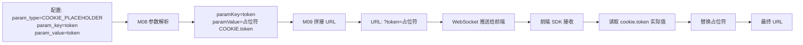
```mermaid
flowchart LR
    A[配置: param_type=COOKIE_PLACEHOLDER<br/>param_key=token<br/>param_value=token] --> B[M08 参数解析]
    B --> C[paramKey=token<br/>paramValue=占位符 COOKIE.token]
    C --> D[M09 拼接 URL]
    D --> E[URL: ?token=占位符]
    E --> F[WebSocket 推送给前端]
    F --> G[前端 SDK 接收]
    G --> H[读取 cookie.token 实际值]
    H --> I[替换占位符]
    I --> J[最终 URL]
```

### 15.3 参数解析器实现

```java
@Component
public class ParamResolver {

    /**
     * 根据 cs_menu_item_param 列表解析最终参数 map
     */
    public Map<String, String> resolveParams(
            List<ItemParam> paramList,
            ParamContext ctx) {
        Map<String, String> result = new LinkedHashMap<>();

        for (ItemParam param : paramList) {
            StandardParamType type;
            try {
                type = StandardParamType.valueOf(param.getParamType());
            } catch (IllegalArgumentException e) {
                log.warn("Unknown param_type: {}", param.getParamType());
                continue;
            }

            String value = resolveValue(type, param, ctx);
            if (value != null) {
                result.put(param.getParamKey(), value);
            }
        }
        return result;
    }

    private String resolveValue(StandardParamType type, ItemParam param,
                                ParamContext ctx) {
        return switch (type.getSourceType()) {
            case LITERAL -> param.getParamValue();
            case SESSION -> ctx.getSession().getValueByPath(type.getDefaultSourceKey());
            case CALL_META -> ctx.getCallMeta().getValueByPath(type.getDefaultSourceKey());
            // DD-V1.1 新增
            case COOKIE -> "${COOKIE." + param.getParamValue() + "}";
                          // param_value 存 cookie 字段名
                          // 输出占位符给前端替换
        };
    }
}
```

### 15.4 简化说明

```
本期不做：
  ✗ 从 ASR 抽取 cardNoLast4 / billMonth / amount
  ✗ LLM 兜底实体抽取

参数缺失处理：
  - 必填参数缺失 → 不展示推荐
  - 选填参数缺失 → 跳转 URL 不带该参数，坐席页面手动输入
```

---

## 16. 跳转指令构建与推送（M09 + M10）

### 16.1 指令结构

```json
{
  "directiveId": "D_202604240001",
  "directiveType": "RECOMMENDATION",
  "callId": "CALL_202604240001",
  "operatorId": "ho212121",
  "configVersion": "20260424.001",
  "expireAt": "2026-04-24T10:01:30Z",

  "intent": {
    "intentCode": "INTENT_TRAVEL_DECLARE",
    "intentName": "境外行程报备"
  },

  "function": {
    "actionId": "act_travel_declare",
    "actionName": "境外行程报备",
    "menuItemId": 12345,
    "functionPath": "信用卡风险侦测系统-参数设置-行程报备登记"
  },

  "display": {
    "title": "识别到：境外行程报备",
    "tip": "您正离开信用卡客服系统，联动至信用卡风险侦测系统",
    "iconUrl": "icons/travel.png"
  },

  "action": {
    "targetSource": "MENU_ITEM",
    "actionType": "OPEN_MENU_ITEM"
  },

  "risk": {
    "riskLevel": "MEDIUM",
    "needConfirm": true
  }
}
```

### 16.2 actionType 派生表

`actionType` 由 `targetKind + openMode` 派生，不存数据库。

| targetKind | openMode | actionType |
|------------|----------|-----------|
| URL | CURRENT_TAB | OPEN_URL |
| URL | NEW_TAB | OPEN_URL_NEW_TAB |
| ROUTE | CURRENT_TAB | OPEN_ROUTE |
| ROUTE | NEW_TAB | OPEN_ROUTE_NEW_TAB |
| COMPONENT | POPUP | OPEN_COMPONENT_POPUP |
| COMPONENT | DRAWER | OPEN_COMPONENT_DRAWER |
| IFRAME | IFRAME | OPEN_IFRAME |
| NEW_WINDOW | WINDOW | OPEN_NEW_WINDOW |

### 16.3 指令构建器

```java
@Component
public class DirectiveBuilder {

    @Autowired private UrlBuilder urlBuilder;
    @Autowired private ParamResolver paramResolver;

    public DirectiveDTO build(BuildContext bc) {
        Map<String, String> params = paramResolver.resolveParams(
            bc.getItem().getParams(), bc.getParamContext());

        // URL 拼接，含 Cookie 占位符
        String urlWithPlaceholders = urlBuilder.buildUrl(
            bc.getItem().getUrl(), params);

        String actionType = deriveActionType(
            bc.getItem().getCopilotExt().getTargetKind(),
            bc.getItem().getCopilotExt().getOpenMode());

        return DirectiveDTO.builder()
            .directiveId(generateDirectiveId())
            .directiveType("RECOMMENDATION")
            .callId(bc.getCallId())
            .operatorId(bc.getOperatorId())
            .configVersion(bc.getConfigVersion())
            .expireAt(Instant.now().plus(30, ChronoUnit.SECONDS).toString())
            .intent(buildIntent(bc))
            .function(buildFunction(bc))
            .display(buildDisplay(bc))
            .action(ActionInfo.builder()
                .targetKind(bc.getItem().getCopilotExt().getTargetKind())
                .openMode(bc.getItem().getCopilotExt().getOpenMode())
                .actionType(actionType)
                .url(urlWithPlaceholders)
                .params(params)
                .build())
            .risk(buildRisk(bc))
            .build();
    }
}
```

### 16.4 URL 多重安全校验（DD-V1.2 调整 P0-5 + P1-12）

> **DD-V1.2 关键修订**：原 DD-V1.1 仅做域名白名单。增加多重校验：
> - 协议必须是 https
> - 生产环境禁止 UAT/DEV 域名
> - baseUrl 已含 query 时同名参数冲突策略
> - 修复尾部分隔符 bug（P1-12）
>
> **不采纳**：路径白名单、query key 白名单（属于过度设计，配置后台已可控）

#### URL 校验流程

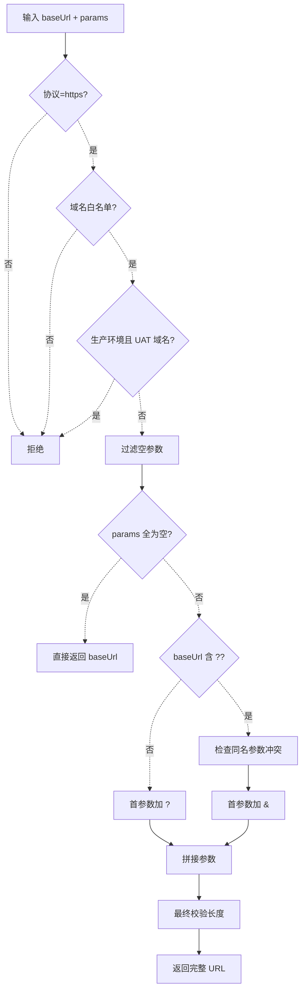
```mermaid
flowchart TD
    A[输入 baseUrl + params] --> B{协议=https?}
    B -.否.-> ERR1[拒绝]
    B -.是.-> C{域名白名单?}
    C -.否.-> ERR1
    C -.是.-> D{生产环境且 UAT 域名?}
    D -.是.-> ERR1
    D -.否.-> E[过滤空参数]
    E --> F{params 全为空?}
    F -.是.-> RET1[直接返回 baseUrl]
    F -.否.-> G{baseUrl 含 ??}
    G -.是.-> H[检查同名参数冲突]
    G -.否.-> I[首参数加 ?]
    H --> I2[首参数加 &]
    I --> J[拼接参数]
    I2 --> J
    J --> K[最终校验长度]
    K --> RET2[返回完整 URL]
```

#### 实现代码

```java
@Component
public class UrlBuilder {
    
    @Value("#{'${copilot.url-whitelist}'.split(',')}")
    private Set<String> urlWhitelist;
    
    @Value("${copilot.url-builder.uat-domains:}")
    private Set<String> uatDomains;  // UAT 域名（在生产环境拦截）
    
    @Value("${spring.profiles.active}")
    private String activeProfile;
    
    @Value("${copilot.url-builder.same-key-policy:OVERRIDE}")
    private String sameKeyPolicy;  // OVERRIDE/PRESERVE/ERROR
    
    public String buildUrl(String baseUrl, Map<String, String> params) {
        // 1. 协议校验（DD-V1.2 P0-5）
        if (!baseUrl.startsWith("https://")) {
            throw new UrlValidationException("Only https protocol allowed: " + baseUrl);
        }
        
        // 2. 域名白名单
        String domain = extractDomain(baseUrl);
        if (!urlWhitelist.contains(domain)) {
            throw new UrlValidationException("Domain not in whitelist: " + domain);
        }
        
        // 3. 生产环境禁 UAT 域名（DD-V1.2 P0-5）
        if ("prod".equals(activeProfile) && uatDomains.contains(domain)) {
            throw new UrlValidationException(
                "UAT domain not allowed in PROD: " + domain);
        }
        
        // 4. 过滤空参数（DD-V1.2 P1-12 修复尾部分隔符 bug）
        Map<String, String> validParams = params.entrySet().stream()
            .filter(e -> e.getValue() != null && !e.getValue().isEmpty())
            .collect(Collectors.toMap(Map.Entry::getKey, Map.Entry::getValue,
                (a, b) -> b, LinkedHashMap::new));
        
        if (validParams.isEmpty()) {
            return baseUrl;  // 没有参数直接返回，不会出现尾部 ?/&
        }
        
        // 5. 同名参数冲突策略（DD-V1.2 P0-5）
        Map<String, String> finalParams = handleSameKeyConflict(baseUrl, validParams);
        
        // 6. 拼接
        StringBuilder sb = new StringBuilder(baseUrl);
        sb.append(baseUrl.contains("?") ? "&" : "?");
        boolean first = true;
        for (Map.Entry<String, String> e : finalParams.entrySet()) {
            if (!first) sb.append("&");
            String value = e.getValue();
            // ${COOKIE.xxx} 占位符不编码（前端替换后再编码）
            if (!value.startsWith("${COOKIE.")) {
                value = URLEncoder.encode(value, StandardCharsets.UTF_8);
            }
            sb.append(e.getKey()).append("=").append(value);
            first = false;
        }
        return sb.toString();
    }
    
    /**
     * 同名参数冲突处理
     * - OVERRIDE：参数 map 中的值覆盖 baseUrl 中已有值（默认）
     * - PRESERVE：保留 baseUrl 中已有值
     * - ERROR：抛异常
     */
    private Map<String, String> handleSameKeyConflict(
            String baseUrl, Map<String, String> params) {
        if (!baseUrl.contains("?")) return params;
        
        // 解析 baseUrl 已有参数
        Map<String, String> existing = parseQueryParams(baseUrl);
        Set<String> conflicts = new HashSet<>(existing.keySet());
        conflicts.retainAll(params.keySet());
        
        if (conflicts.isEmpty()) return params;
        
        log.warn("Param key conflict: {}, policy: {}", conflicts, sameKeyPolicy);
        
        return switch (sameKeyPolicy) {
            case "OVERRIDE" -> params;  // 默认：params 覆盖
            case "PRESERVE" -> {
                Map<String, String> result = new LinkedHashMap<>(params);
                conflicts.forEach(result::remove);
                yield result;
            }
            case "ERROR" -> throw new UrlValidationException(
                "Param key conflict: " + conflicts);
            default -> throw new IllegalStateException();
        };
    }
}
```

#### 配置

```yaml
copilot:
  url-whitelist: 
    - frdctrfront.paas.cmbchina.cn
    - mccusweb.paas.cmbchina.cn
  url-builder:
    uat-domains:
      - frdctrfront.paasuat.cmbchina.cn
      - mccusweb.paasuat.cmbchina.cn
    same-key-policy: OVERRIDE  # OVERRIDE / PRESERVE / ERROR
```

#### 简化说明

```
✗ 不做（属于过度设计或后续阶段）：
  - 路径白名单（域名级足够）
  - query key 白名单（参数由配置生成可控）
  - 完整一次性 token（F14）
```

### 16.5 WebSocket 推送（M10）

```java
@Component
public class CopilotPushService {

    @Autowired private SimpMessagingTemplate messagingTemplate;

    public void pushDirective(DirectiveDTO directive) {
        String destination = "/user/" + directive.getOperatorId()
            + "/copilot/directive";
        try {
            messagingTemplate.convertAndSend(destination, directive);
            log.info("Pushed: directiveId={}, operatorId={}",
                directive.getDirectiveId(), directive.getOperatorId());
        } catch (Exception e) {
            log.error("Push failed: {}", directive.getDirectiveId(), e);
        }
    }
}
```

> 注：复用工作台已有 WebSocket 基础设施。

---

## 17. 反馈处理（M11）

### 17.1 反馈类型

| feedbackType | 含义 | 后端处理 |
|--------------|------|---------|
| ACCEPTED | 坐席点击打开 | 持久化日志 + 追加 executedSteps |
| IGNORED | 坐席忽略 | 60s 内不重复推荐相同 intentCode |
| WRONG_INTENT | 意图识别错误 | 本通话内静默该 intentCode |
| WRONG_FUNCTION | 意图对，功能映射错 | 本通话内静默该 actionId |

### 17.2 反馈接口

详见第五篇 25 章。

### 17.3 处理流程

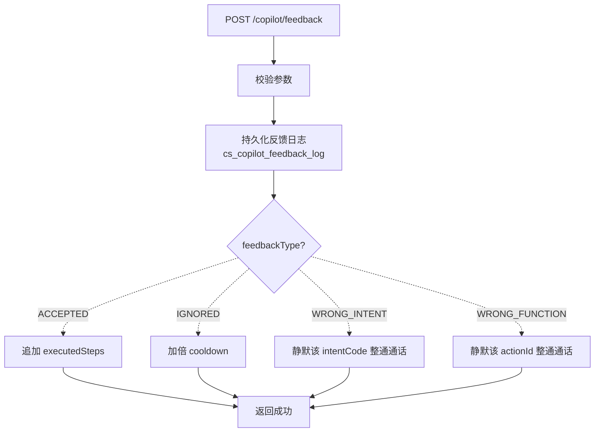
```mermaid
flowchart TD
    A[POST /copilot/feedback] --> B[校验参数]
    B --> C[持久化反馈日志<br/>cs_copilot_feedback_log]
    C --> D{feedbackType?}
    D -.ACCEPTED.-> E[追加 executedSteps]
    D -.IGNORED.-> F[加倍 cooldown]
    D -.WRONG_INTENT.-> G[静默该 intentCode 整通通话]
    D -.WRONG_FUNCTION.-> H[静默该 actionId 整通通话]
    E --> END[返回成功]
    F --> END
    G --> END
    H --> END
```

### 17.4 关键代码骨架

```java
@Service
public class FeedbackService {

    @Autowired private FeedbackLogDao feedbackLogDao;
    @Autowired private TriggerLogDao triggerLogDao;
    @Autowired private ExecutedStepsManager stepsManager;
    @Autowired private MuteListManager muteListManager;
    @Autowired private MetricsService metricsService;

    public FeedbackResult handleFeedback(FeedbackRequest req) {
        // 【DD-V1.2 P0-6】1. 服务端指令校验
        TriggerLogRecord triggerLog = triggerLogDao.findByDirectiveId(req.getDirectiveId());
        if (triggerLog == null) {
            return FeedbackResult.fail("DIRECTIVE_NOT_FOUND");
        }
        
        // 1.1 过期校验
        if (triggerLog.getExpireAt() != null 
                && Instant.now().isAfter(triggerLog.getExpireAt())) {
            return FeedbackResult.fail("DIRECTIVE_EXPIRED");
        }
        
        // 1.2 上下文匹配校验
        if (!triggerLog.getCallId().equals(req.getCallId())
                || !Objects.equals(triggerLog.getOperatorId(), req.getOperatorId())
                || !Objects.equals(triggerLog.getIntentCode(), req.getIntentCode())
                || !Objects.equals(triggerLog.getItemId(), req.getItemId())) {
            log.warn("Feedback context mismatch: directiveId={}, req={}, log={}", 
                req.getDirectiveId(), req, triggerLog);
            return FeedbackResult.fail("CONTEXT_MISMATCH");
        }
        
        // 【DD-V1.2 P1-14】2. 幂等控制：检查是否已有有效反馈
        boolean alreadyEffective = feedbackLogDao.existsEffective(req.getDirectiveId());
        boolean isEffective = !alreadyEffective;  // 首次为 Y，后续为 N
        
        // 3. 持久化（含 trigger_log_id 反查 - P1-15）
        FeedbackLog logEntity = toLog(req);
        logEntity.setTriggerLogId(triggerLog.getLogId());
        logEntity.setIsEffective(isEffective ? "Y" : "N");
        feedbackLogDao.insert(logEntity);
        metricsService.recordFeedback(req.getFeedbackType());
        
        // 4. 仅有效反馈影响业务状态
        if (!isEffective) {
            return FeedbackResult.success("DUPLICATE_RECORDED");
        }
        
        switch (req.getFeedbackType()) {
            case "ACCEPTED" -> stepsManager.appendStep(
                req.getCallId(), req.getIntentCode(), req.getIntentName());
            case "IGNORED" -> muteListManager.muteIntent(
                req.getCallId(), req.getIntentCode(), Duration.ofSeconds(120));
            case "WRONG_INTENT" -> muteListManager.muteIntentForCall(
                req.getCallId(), req.getIntentCode());
            case "WRONG_FUNCTION" -> muteListManager.muteItemForCall(
                req.getCallId(), req.getItemId());
        }
        
        return FeedbackResult.success("EFFECTIVE");
    }
}
```

#### 数据库幂等保证

> DD-V1.2 P1-14：trigger_log.directive_id 唯一索引；feedback_log 增加 is_effective 字段。
> 详见第四篇 21 章 DDL。

### 17.5 静默列表

```java
@Component
public class MuteListManager {

    @Autowired private RedisTemplate<String, String> redisTemplate;

    public void muteIntentForCall(String callId, String intentCode) {
        String key = "copilot:mute:intent:" + callId;
        redisTemplate.opsForSet().add(key, intentCode);
        redisTemplate.expire(key, Duration.ofHours(2));
    }

    public boolean isIntentMuted(String callId, String intentCode) {
        return Boolean.TRUE.equals(
            redisTemplate.opsForSet().isMember(
                "copilot:mute:intent:" + callId, intentCode));
    }

    // 类似地：muteItemForCall / isItemMuted
}
```

---

## 18. 业务监控埋点（M16）— DD-V1.1 新增

### 18.1 埋点目标

> 按你的指示：业务面监控只做数据落库，不做看板。看板留待 F10 / F11 后续实现。

```
落库的是结构化业务数据，便于：
  - 后续基于这些数据做看板（F10、F11）
  - 运营人员通过 SQL 查询做 Bad Case 分析
  - 配置质量评估
```

### 18.2 埋点位置

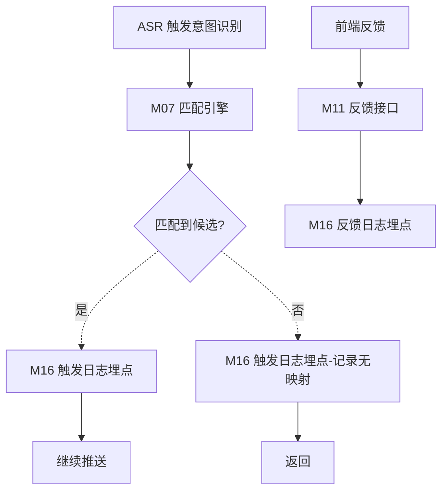
```mermaid
flowchart TD
    A[ASR 触发意图识别] --> B[M07 匹配引擎]
    B --> C{匹配到候选?}
    C -.是.-> D[M16 触发日志埋点]
    C -.否.-> E[M16 触发日志埋点-记录无映射]
    D --> F[继续推送]
    E --> END[返回]

    G[前端反馈] --> H[M11 反馈接口]
    H --> I[M16 反馈日志埋点]
```

### 18.3 触发日志埋点点位

```
触发点 1：意图识别成功后
  - 记录 intentCode 是否在映射表中（无映射意图标记）
  - 记录 candidateCount

触发点 2：候选过滤后
  - 记录 action 启用、静默列表、菜单项关联校验结果
  - 记录最终选定的 actionId 和可选 menuItemId

触发点 3：指令推送后
  - 记录 directiveId
```

### 18.4 反馈日志埋点点位

```
反馈接口入口（M11）
  - 记录每条反馈
  - 字段含 directiveId / call_id / operator_id / intentCode / actionId / menuItemId / feedbackType
```

### 18.5 关键字段（DD-V1.2 扩展 P1-16，详细 DDL 见第四篇）

> DD-V1.2 增加 result_status / reason_code / filter_stage 等字段，便于 Bad Case 分析和后续看板。

```
cs_copilot_trigger_log（触发日志，DD-V1.2 字段扩展）
  log_id              主键
  call_id             通话 ID
  operator_id         坐席工号
  customer_id         客户号
  intent_code         意图代码
  intent_name         意图名称
  action_id           Copilot 动作 ID
  action_name         Copilot 动作名称
  menu_item_id        可选关联菜单项
  candidate_count     候选数量
  risk_level          风险等级
  directive_id        指令 ID（UNIQUE 索引 P0-6）
  expire_at           指令过期时间（DD-V1.2 P0-6）
  directive_status    指令状态（DD-V1.2 P0-6）
  
  # 业务结果（DD-V1.2 P1-16）
  result_status       结果状态：SUCCESS / FAIL / FILTERED
  reason_code         原因编码（详见下方枚举）
  filter_stage        过滤发生的阶段
  
  # 通用
  trigger_time        触发时间
  config_version      配置版本

cs_copilot_feedback_log（反馈日志，DD-V1.2 字段扩展）
  log_id              主键
  directive_id        指令 ID
  trigger_log_id      关联触发日志（DD-V1.2 P1-15 强制反查）
  call_id             通话 ID
  operator_id         坐席工号
  feedback_type       反馈类型
  intent_code         意图代码
  action_id           Copilot 动作 ID
  menu_item_id        可选关联菜单项
  is_effective        是否有效反馈 Y/N（DD-V1.2 P1-14 幂等）
  feedback_time       反馈时间
```

#### reason_code 枚举（DD-V1.2 新增 P1-16）

```
# AI 相关
AI_TIMEOUT                 AI 调用超时
AI_FAILED                  AI 业务失败
AI_CIRCUIT_BREAKER_OPEN    熔断打开
INTENT_EMPTY               AI 返回空意图
INTENT_NOT_MAPPED          意图未配置映射

# 配置相关
RISK_DISABLED              风险等级禁用
URL_NOT_ALLOWED            URL 白名单失败
COOKIE_NOT_ALLOWED         Cookie 白名单失败
PARAM_MISSING              必填参数缺失

# 会话相关
SESSION_BIND_MISSING       callSession 绑定缺失
GRAY_FILTERED              灰度白名单过滤
MUTED_BY_AGENT             坐席本通话已忽略
AI_CALL_LIMIT_EXCEEDED     单通话 AI 调用超限

# 推送相关
PUSH_FAILED                推送失败
FRONT_PERMISSION_FILTERED  前端权限过滤（来自反馈）
FRONT_COOLDOWN             前端冷却（来自反馈）
```

#### filter_stage 枚举

```
SESSION_BIND               会话绑定层
GRAY_WHITELIST             灰度白名单层
INTENT_RECOGNITION         意图识别层
INTENT_MAPPING             意图映射层
CONDITION_RULE             条件规则层
PARAM_RESOLVE              参数解析层
URL_VALIDATION             URL 校验层
PUSH                       推送层
FRONT_PERMISSION           前端权限层
FRONT_COOLDOWN             前端频控层
```

### 18.6 后续看板（F10/F11）依赖

```
本期落库的字段足够支撑后续看板：
  - 触发统计：按 intent_code / action_id / menu_item_id 分组 COUNT
  - 采纳率：feedback_log JOIN trigger_log
  - 错误推荐：feedback_type IN (WRONG_INTENT, WRONG_FUNCTION)
  - 无映射意图 TopN：trigger_log 中 action_id IS NULL 的记录
```

---

## 19. 前端 SDK（M14 + M15）

### 19.1 SDK 架构

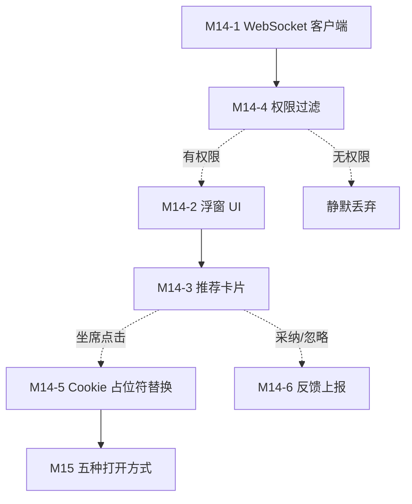
```mermaid
graph TB
    WS[M14-1 WebSocket 客户端]
    PERM[M14-4 权限过滤]
    UI[M14-2 浮窗 UI]
    CARD[M14-3 推荐卡片]
    COOKIE[M14-5 Cookie 占位符替换]
    FEEDBACK[M14-6 反馈上报]
    OPEN[M15 五种打开方式]

    WS --> PERM
    PERM -.有权限.-> UI
    PERM -.无权限.-> SKIP[静默丢弃]
    UI --> CARD
    CARD -.坐席点击.-> COOKIE
    COOKIE --> OPEN
    CARD -.采纳/忽略.-> FEEDBACK
```

### 19.2 接收指令处理流程

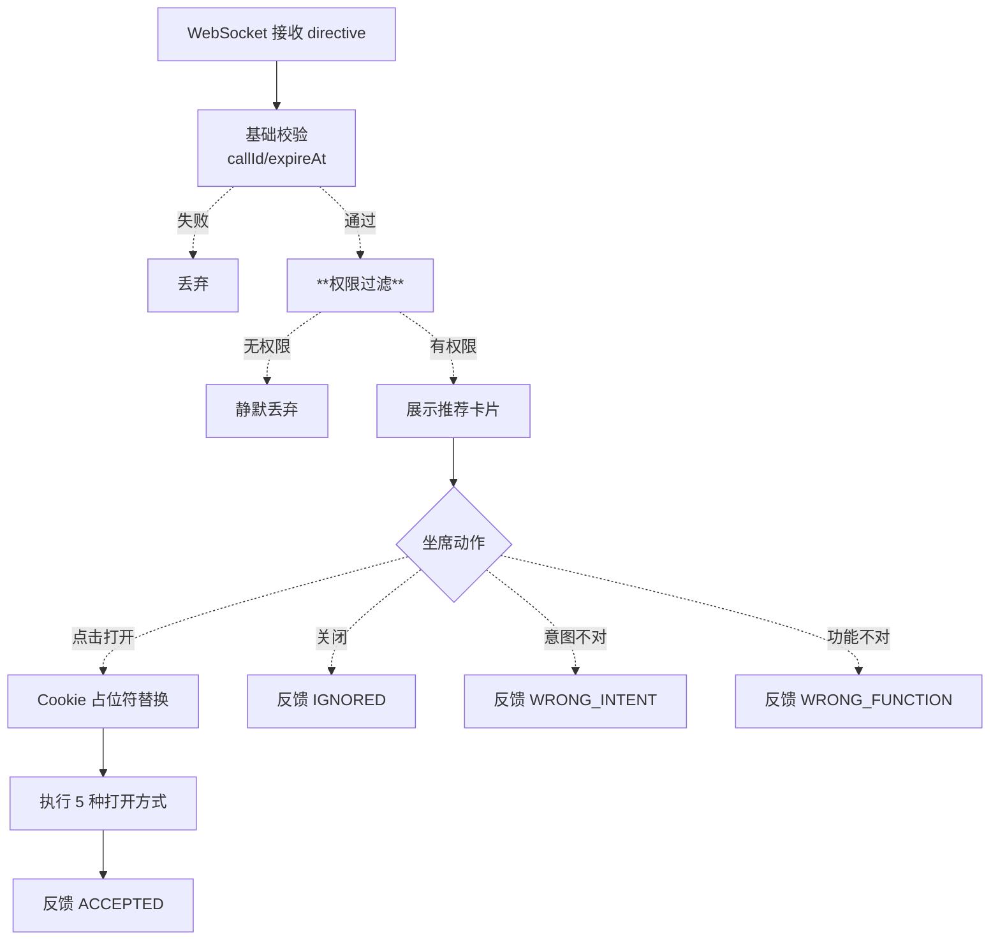
```mermaid
flowchart TD
    A[WebSocket 接收 directive] --> B[基础校验<br/>callId/expireAt]
    B -.失败.-> ERR1[丢弃]
    B -.通过.-> C[**权限过滤**]
    C -.无权限.-> SKIP[静默丢弃]
    C -.有权限.-> D[展示推荐卡片]
    D --> E{坐席动作}
    E -.点击打开.-> F[Cookie 占位符替换]
    F --> G[执行 5 种打开方式]
    G --> H[反馈 ACCEPTED]
    E -.关闭.-> I[反馈 IGNORED]
    E -.意图不对.-> J[反馈 WRONG_INTENT]
    E -.功能不对.-> K[反馈 WRONG_FUNCTION]
```

### 19.3 权限过滤（M14-4，DD-V1.2 调整 P1-20）

> DD-V1.1 关键设计：前端基于工作台已有权限体系判断，过滤无权功能不展示。
> **DD-V1.2 增强**：权限 API 不可用时 fail closed，不展示推荐。

```javascript
// SDK 启动时检测权限 API 可用性
const checkPermissionApiAvailable = () => {
  if (typeof window.MenuPermission === 'undefined' 
      || typeof window.MenuPermission.hasItemAccess !== 'function') {
    console.error('[Copilot] Permission API not available');
    reportToServer('FRONT_PERMISSION_UNAVAILABLE');
    return false;
  }
  return true;
};

let permissionApiAvailable = false;
window.addEventListener('load', () => {
  permissionApiAvailable = checkPermissionApiAvailable();
});

// 权限过滤（DD-V1.2 fail closed）
const permissionFilter = (directive) => {
  if (!permissionApiAvailable) {
    // 权限 API 不可用：不展示推荐，避免误展示
    console.warn('[Copilot] Permission unavailable, fail closed');
    return false;
  }
  
  try {
    const menuItemId = directive.function.menuItemId;
    if (!menuItemId) {
      // 纯 action 没有菜单权限锚点，按 Copilot 配置和灰度控制展示。
      // 若业务要求纯 action 也做权限控制，需要补充 action 级权限模型。
      return true;
    }
    const hasPermission = window.MenuPermission.hasItemAccess(menuItemId);
    if (!hasPermission) {
      submitFeedback(directive, 'NO_PERMISSION');  // 上报反馈
      return false;
    }
    return true;
  } catch (e) {
    console.error('[Copilot] Permission check failed:', e);
    submitFeedback(directive, 'PERMISSION_CHECK_ERROR');
    return false;  // 异常时 fail closed
  }
};

// WebSocket 消息处理
const handleDirective = (directive) => {
  if (isExpired(directive)) {
    submitFeedback(directive, 'EXPIRED');
    return;
  }
  if (directive.callId !== currentCallId) {
    submitFeedback(directive, 'CALL_MISMATCH');
    return;
  }
  if (!permissionFilter(directive)) {
    return;  // 静默丢弃
  }
  
  // DD-V1.2 P2-12 卡片频控：见 19.7
  if (!cardFrequencyControl(directive)) return;
  
  showRecommendCard(directive);
};
```

### 19.4 Cookie 占位符替换（M14-5）

> DD-V1.1 关键设计：URL 中 `${COOKIE.xxx}` 占位符由前端从 cookie 读取实际值后替换。

```javascript
const COOKIE_PATTERN = /\$\{COOKIE\.(\w+)\}/g;

const COOKIE_NAME_PATTERN = /^[A-Za-z0-9_.-]+$/;  // P2-5 兼容含 .- 的 cookie 名

// DD-V1.2 P0-4：Cookie 白名单 + 域名绑定校验
const validateCookieAccess = (cookieName, targetUrl) => {
  if (!ALLOWED_COOKIES.includes(cookieName)) {
    return { ok: false, reason: 'COOKIE_NOT_IN_WHITELIST' };
  }
  const targetDomain = new URL(targetUrl).hostname;
  const allowedForDomain = DOMAIN_BINDINGS[targetDomain] || [];
  if (!allowedForDomain.includes(cookieName)) {
    return { ok: false, reason: 'COOKIE_NOT_ALLOWED_FOR_DOMAIN' };
  }
  return { ok: true };
};

// URL 场景的替换（DD-V1.2 P1-13：必填 Cookie 缺失阻断）
const replaceCookiePlaceholdersInUrl = (url) => {
  let blocked = false;
  let blockReason = '';
  const finalUrl = url.replace(COOKIE_PATTERN, (match, cookieName) => {
    const access = validateCookieAccess(cookieName, url);
    if (!access.ok) {
      blocked = true;
      blockReason = access.reason;
      return match;
    }
    const value = getCookie(cookieName);
    if (value === null) {
      // P1-13：必填 Cookie 缺失则阻断；可选 Cookie 跳过
      if (REQUIRED_COOKIES.includes(cookieName)) {
        blocked = true;
        blockReason = 'REQUIRED_COOKIE_MISSING';
        return match;
      } else {
        return '';  // 可选 Cookie 缺失：替换为空（不保留占位符）
      }
    }
    return encodeURIComponent(value);
  });
  return { url: finalUrl, blocked, reason: blockReason };
};

// DD-V1.2 P2-6：params 字段语义明确
// - 当 actionType 是 OPEN_URL/OPEN_IFRAME 等 URL 场景：params 仅用于回显或日志，URL 已包含全部参数（已 encode）
// - 当 actionType 是 OPEN_COMPONENT_POPUP/DRAWER：params 作为 Vue 组件 props 传入，**不应 encode**
const replaceCookieInComponentProps = (params) => {
  const result = {};
  for (const [k, v] of Object.entries(params)) {
    if (typeof v === 'string') {
      result[k] = v.replace(COOKIE_PATTERN, (m, n) => {
        const val = getCookie(n);
        return val ?? m;  // 组件 props 不 encode
      });
    } else {
      result[k] = v;
    }
  }
  return result;
};

// 打开前替换
const openWithReplacement = (directive) => {
  if (directive.action.actionType.startsWith('OPEN_URL') 
      || directive.action.actionType === 'OPEN_IFRAME'
      || directive.action.actionType === 'OPEN_NEW_WINDOW') {
    // URL 场景
    const result = replaceCookiePlaceholdersInUrl(directive.action.url);
    if (result.blocked) {
      showError(`无法打开：${result.reason}`);
      submitFeedback(directive, 'OPEN_BLOCKED', result.reason);
      return;
    }
    executeOpen(directive.action.actionType, result.url, null);
  } else if (directive.action.actionType.startsWith('OPEN_COMPONENT_')) {
    // 组件场景
    const finalProps = replaceCookieInComponentProps(directive.action.params);
    executeOpen(directive.action.actionType, null, finalProps);
  } else {
    // 路由场景
    const result = replaceCookiePlaceholdersInUrl(directive.action.url);
    if (result.blocked) {
      showError(`无法打开：${result.reason}`);
      return;
    }
    executeOpen(directive.action.actionType, result.url, null);
  }
};
```

### 19.5 五种打开方式（M15）

| actionType | 实现 |
|-----------|------|
| OPEN_URL | `window.location.href = url` |
| OPEN_URL_NEW_TAB | `window.open(url, '_blank')` |
| OPEN_ROUTE | `router.push(routePath)`（Vue Router） |
| OPEN_ROUTE_NEW_TAB | 拼接路由后 `window.open` |
| OPEN_COMPONENT_POPUP | 调用工作台已有 Modal 组件 |
| OPEN_COMPONENT_DRAWER | 调用工作台已有 Drawer 组件 |
| OPEN_IFRAME | 工作台已有 iframe 容器 |
| OPEN_NEW_WINDOW | `window.open(url, name, features)` |

### 19.6 卡片频控（DD-V1.2 新增 P2-12）

> 防止同通话频繁推荐打扰坐席。

```javascript
const recentDirectives = new Map();  // directiveId → timestamp
const recentIntents = new Map();     // intentCode → timestamp

const cardFrequencyControl = (directive) => {
  // ① directiveId 去重（5 秒内同一指令不重复展示）
  const lastShownTime = recentDirectives.get(directive.directiveId);
  if (lastShownTime && Date.now() - lastShownTime < 5000) {
    return false;
  }
  
  // ② intentCode 冷却（30 秒内同意图不重复展示）
  const lastIntentTime = recentIntents.get(directive.intent.intentCode);
  if (lastIntentTime && Date.now() - lastIntentTime < 30000) {
    submitFeedback(directive, 'FRONT_COOLDOWN');
    return false;
  }
  
  // ③ 单通话最多 5 次卡片展示
  if (cardsShownInCall >= 5) {
    submitFeedback(directive, 'FRONT_MAX_CARDS_REACHED');
    return false;
  }
  
  recentDirectives.set(directive.directiveId, Date.now());
  recentIntents.set(directive.intent.intentCode, Date.now());
  cardsShownInCall++;
  return true;
};

// 通话结束时清理
window.addEventListener('callEnd', () => {
  recentDirectives.clear();
  recentIntents.clear();
  cardsShownInCall = 0;
});
```

### 19.7 浮窗 UI 简述

```
位置：右下角浮窗
状态：
  - 空闲：仅显示小图标
  - 推荐展示：弹出卡片（intentName + functionName + 打开按钮 + 反馈按钮）
  - AI 不可用：图标变灰

交互：
  - 点击打开 → 触发 OPEN_xxx → 反馈 ACCEPTED
  - 点击关闭 → 反馈 IGNORED
  - 点击"意图不对" → 反馈 WRONG_INTENT
  - 点击"功能不对" → 反馈 WRONG_FUNCTION
```

---
# 第四篇 数据模型

## 20. 复用存量表

本期完全不动以下存量表的结构。Copilot 配置不再写入菜单发布 CLOB，菜单表只在 action 显式关联 `menu_item_id` 时参与校验和运行时目标解析。

| 表名 | 说明 |
|------|------|
| `cs_menu_item` | 核心菜单项（item_id 主键） |
| `cs_menu_item_param` | 参数列表（含 13 个标准 param_type） |
| `cs_menu_item_info` | 悬浮信息（owner / tech 联系人） |
| `cs_menu_group` | 分组 |
| `cs_menu_module` | 模块 |
| `cs_menu_module_item` | 模块-菜单项关联 |
| `cs_menu_group_authority` | 分组权限（**仅用于配置后台权限**，不用于业务跳转权限校验） |
| `cs_menu_version` | 菜单发布 CLOB 快照表；Copilot 不写入 `copilotIndex`，也不从该表解析运行时配置 |

Copilot 与菜单的关系：

- `cs_copilot_action.menu_item_id` 可为空。为空时表示纯 Copilot action，跳转目标由 action 自身配置提供。
- `cs_copilot_action.menu_item_id` 不为空时表示复用快捷导航菜单项。运行时以 `cs_menu_item` 及其参数配置为准，action 中的 item 快照只用于校验、审计和运营展示。
- 不使用数据库外键。关联关系由配置发布校验和服务启动/刷新校验保证，避免 Copilot 配置表强绑定菜单表生命周期。
- `cs_menu_version.config_data` 继续由菜单发布流程维护，Copilot 不修改该 JSON 结构。

---

## 21. 新增表完整 DDL

### 21.1 ER 关系图

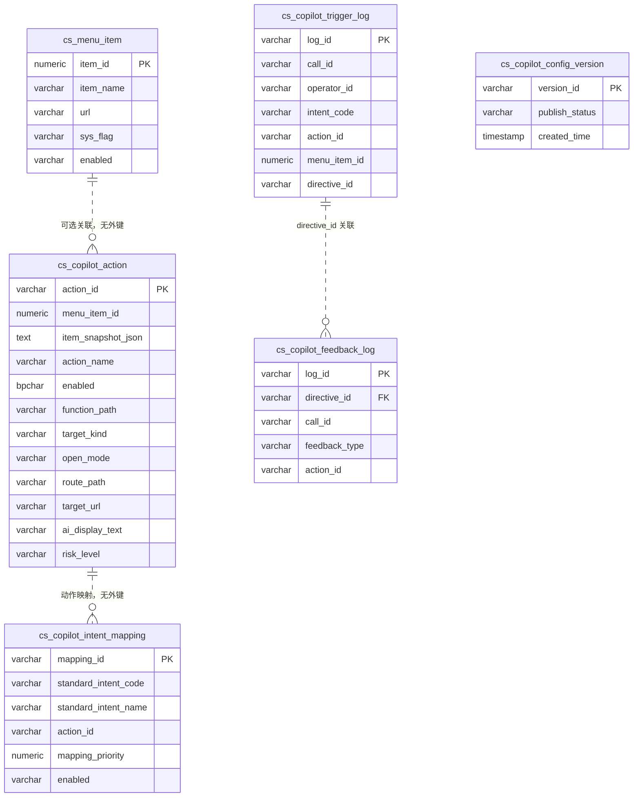
```mermaid
erDiagram
    cs_menu_item ||..o{ cs_copilot_action : "可选关联，无外键"
    cs_copilot_action ||..o{ cs_copilot_intent_mapping : "动作映射，无外键"
    cs_copilot_trigger_log ||..o{ cs_copilot_feedback_log : "directive_id 关联"

    cs_menu_item {
        numeric item_id PK
        varchar item_name
        varchar url
        varchar sys_flag
        varchar enabled
    }

    cs_copilot_action {
        varchar action_id PK
        numeric menu_item_id
        text item_snapshot_json
        varchar action_name
        bpchar enabled
        varchar function_path
        varchar target_kind
        varchar open_mode
        varchar route_path
        varchar target_url
        varchar ai_display_text
        varchar risk_level
    }

    cs_copilot_intent_mapping {
        varchar mapping_id PK
        varchar standard_intent_code
        varchar standard_intent_name
        varchar action_id
        numeric mapping_priority
        varchar enabled
    }

    cs_copilot_config_version {
        varchar version_id PK
        varchar publish_status
        timestamp created_time
    }

    cs_copilot_trigger_log {
        varchar log_id PK
        varchar call_id
        varchar operator_id
        varchar intent_code
        varchar action_id
        numeric menu_item_id
        varchar directive_id
    }

    cs_copilot_feedback_log {
        varchar log_id PK
        varchar directive_id FK
        varchar call_id
        varchar feedback_type
        varchar action_id
    }
```

### 21.2 cs_copilot_action（Copilot 动作配置表）

#### 完整 DDL

```sql
CREATE TABLE svccfg.cs_copilot_action (
    action_id               varchar(64) NOT NULL,

    -- 可选快捷导航关联，不加外键
    menu_item_id            numeric(131089,0),
    item_snapshot_json      text,

    -- 动作基本信息
    action_name             varchar(128) NOT NULL,
    enabled                 char(1) DEFAULT 'Y' NOT NULL,
    function_path           varchar(256),

    -- 打开方式；menu_item_id 为空时必填，关联菜单项时仅作为快照或可留空
    target_kind             varchar(16),
    open_mode               varchar(16),
    target_url              varchar(512),
    route_path              varchar(256),
    window_feature          varchar(256),

    -- AI 展示
    ai_display_text         varchar(128) NOT NULL,
    floating_tip_text       varchar(256),

    -- 风险（人工指定，无自动派生）
    risk_level              varchar(16) DEFAULT 'LOW' NOT NULL,

    -- UI
    icon_url                varchar(256),

    -- 非快捷导航动作的参数配置，JSON 数组，结构同 ItemParam
    param_config_json       text,

    -- 审计
    created_by              varchar(32),
    created_name            varchar(40),
    created_time            timestamp,
    updated_by              varchar(32),
    updated_name            varchar(40),
    updated_time            timestamp,

    CONSTRAINT cs_copilot_action_pkey PRIMARY KEY (action_id)
);

CREATE INDEX idx_copilot_action_enabled
    ON svccfg.cs_copilot_action(enabled);

CREATE INDEX idx_copilot_action_menu_item
    ON svccfg.cs_copilot_action(menu_item_id);
```

#### 字段说明

| 字段 | 类型 | 必填 | 说明 |
|------|------|------|------|
| action_id | varchar(64) | 是 | Copilot 动作主键，业务稳定 ID |
| menu_item_id | numeric(131089,0) | 否 | 可选关联 `cs_menu_item.item_id`，无外键 |
| item_snapshot_json | text | 否 | 关联菜单项时的快照，用于校验、审计和运营展示，不作为运行时事实来源 |
| action_name | varchar(128) | 是 | Copilot 动作名称 |
| enabled | char(1) | 是 | Y/N |
| function_path | varchar(256) | 否 | 运营标注的功能路径 |
| target_kind | varchar(16) | 条件必填 | `menu_item_id` 为空时必填；URL / ROUTE / IFRAME / NEW_WINDOW |
| open_mode | varchar(16) | 条件必填 | `menu_item_id` 为空时必填；CURRENT_TAB / NEW_TAB / WINDOW / IFRAME |
| target_url | varchar(512) | 条件必填 | `target_kind` 为 URL / IFRAME / NEW_WINDOW 时填 |
| route_path | varchar(256) | 条件必填 | `target_kind` 为 ROUTE 时填 |
| window_feature | varchar(256) | 否 | 新窗口特性 |
| ai_display_text | varchar(128) | 是 | 浮窗 AI 展示文字 |
| floating_tip_text | varchar(256) | 否 | 跳转前提示 |
| risk_level | varchar(16) | 是 | LOW / MEDIUM / HIGH / DISABLED，默认 LOW |
| icon_url | varchar(256) | 否 | 图标 URL |
| param_config_json | text | 否 | 纯 action 参数配置；关联菜单项时不使用 |
| created_by / created_name / created_time | - | 是 | 创建审计 |
| updated_by / updated_name / updated_time | - | 否 | 更新审计 |

#### 关联菜单项时的取值规则

- `menu_item_id` 为空：运行时使用 action 自身的 `target_kind/open_mode/target_url/route_path/param_config_json`。
- `menu_item_id` 不为空：运行时指令只携带 `menuItemId` 和 `targetSource=MENU_ITEM`，由前端复用现有快捷导航打开逻辑；action 目标字段可留空，也可保存为快照，不能作为实际跳转事实来源。
- `item_snapshot_json` 不为空时，发布校验需比较快照与当前菜单项是否一致。
- action 与菜单项不加外键。菜单项删除、禁用、字段不一致由发布校验阻断；运行时刷新遇到异常配置时整版刷新失败并保留上一版快照。

### 21.3 cs_copilot_intent_mapping（意图映射表）

#### 完整 DDL

```sql
CREATE TABLE svccfg.cs_copilot_intent_mapping (
    mapping_id              varchar(64) NOT NULL,

    -- AI 意图
    standard_intent_code    varchar(64) NOT NULL,
    standard_intent_name    varchar(256),

    -- 关联 Copilot 动作，不加外键
    action_id               varchar(64) NOT NULL,

    -- 优先级
    mapping_priority        numeric(5,0) DEFAULT 0,

    -- 启用
    enabled                 char(1) DEFAULT 'Y' NOT NULL,

    -- 审计
    created_by              varchar(32),
    created_name            varchar(40),
    created_time            timestamp,
    updated_by              varchar(32),
    updated_name            varchar(40),
    updated_time            timestamp,

    CONSTRAINT cs_copilot_intent_mapping_pkey PRIMARY KEY (mapping_id),
    CONSTRAINT uq_intent_action UNIQUE (standard_intent_code, action_id)
);

CREATE INDEX idx_intent_mapping_intent
    ON svccfg.cs_copilot_intent_mapping(standard_intent_code, enabled);

CREATE INDEX idx_intent_mapping_action
    ON svccfg.cs_copilot_intent_mapping(action_id);
```

#### 字段说明

| 字段 | 类型 | 必填 | 说明 |
|------|------|------|------|
| mapping_id | varchar(64) | 是 | UUID |
| standard_intent_code | varchar(64) | 是 | AI 接口的 intentCode（字符串，如 INTENT_BILL_QUERY） |
| standard_intent_name | varchar(256) | 否 | 意图名称（仅展示用） |
| action_id | varchar(64) | 是 | 关联 `cs_copilot_action.action_id`，无外键 |
| mapping_priority | numeric(5,0) | 否 | 同 intentCode 多候选优先级 |
| enabled | char(1) | 是 | Y/N |

> `condition_rule` 已删除：本期不引入运行时 JSON Rule 评估，避免配置表达能力超出当前验证和测试能力。后续如果需要复杂条件，应作为独立规则引擎能力设计。

### 21.4 cs_copilot_config_version（Copilot 配置版本表）

#### 完整 DDL

```sql
CREATE TABLE svccfg.cs_copilot_config_version (
    version_id              varchar(32) NOT NULL,
    publish_status          varchar(16) DEFAULT 'PUBLISHED' NOT NULL,
    change_summary          varchar(512),
    created_by              varchar(32) NOT NULL,
    created_name            varchar(40) NOT NULL,
    created_time            timestamp NOT NULL,

    CONSTRAINT cs_copilot_config_version_pkey PRIMARY KEY (version_id)
);

CREATE INDEX idx_copilot_config_version_time
    ON svccfg.cs_copilot_config_version(created_time);
```

#### 字段说明

| 字段 | 类型 | 必填 | 说明 |
|------|------|------|------|
| version_id | varchar(32) | 是 | Copilot 配置版本号，独立于 `cs_menu_version.version_id` |
| publish_status | varchar(16) | 是 | PUBLISHED / DISABLED，MVP 只使用 PUBLISHED |
| change_summary | varchar(512) | 否 | 发布说明 |
| created_by / created_name / created_time | - | 是 | 发布审计 |

服务各 Pod 轮询该表最新 `version_id`。版本变化后重新读取 action、intent mapping 以及必要的菜单项配置，并在本地构建不可变快照。

### 21.5 cs_copilot_trigger_log（触发日志表）

> **DD-V1.2 调整**：
> - P0-6：directive_id 增加 UNIQUE 索引；增加 expire_at、directive_status
> - P1-16：保留 result_status / reason_code / filter_stage
> - Action 化改造：记录 action_id / action_name，menu_item_id 可为空
> - 删除 ai_request_id / ai_response_time_ms / ai_failure_reason / missing_params_json / asr_confidence / asr_text_hash
> - P2-2：operator_id 长度从 varchar(16) 改为 varchar(32)

#### 完整 DDL

```sql
CREATE TABLE svccfg.cs_copilot_trigger_log (
    log_id                  varchar(64) NOT NULL,

    -- 上下文
    call_id                 varchar(64) NOT NULL,
    operator_id             varchar(32),                  -- DD-V1.2 P2-2 长度调整
    customer_id             varchar(64),

    -- 意图识别
    intent_code             varchar(64),
    intent_name             varchar(256),

    -- 匹配结果
    action_id               varchar(64),
    action_name             varchar(128),
    menu_item_id            numeric(131089,0),
    candidate_count         numeric(5,0),

    -- 推荐策略
    risk_level              varchar(16),
    directive_id            varchar(64),
    expire_at               timestamp,                    -- DD-V1.2 P0-6 指令过期时间
    directive_status        varchar(16),                  -- DD-V1.2 P0-6 PUSHED/EXPIRED/CONSUMED

    -- 业务结果
    result_status           varchar(32),                  -- SUCCESS/FAIL/FILTERED
    reason_code             varchar(64),                  -- 原因编码
    filter_stage            varchar(32),                  -- 过滤阶段

    -- 通用
    trigger_time            timestamp NOT NULL,
    config_version          varchar(32),

    CONSTRAINT cs_copilot_trigger_log_pkey PRIMARY KEY (log_id)
);

-- DD-V1.2 P0-6 + P1-15：directive_id 唯一索引（保证反查稳定）
CREATE UNIQUE INDEX uq_trigger_log_directive
    ON svccfg.cs_copilot_trigger_log(directive_id)
    WHERE directive_id IS NOT NULL;

CREATE INDEX idx_trigger_log_call ON svccfg.cs_copilot_trigger_log(call_id);
CREATE INDEX idx_trigger_log_intent
    ON svccfg.cs_copilot_trigger_log(intent_code, trigger_time);
CREATE INDEX idx_trigger_log_action
    ON svccfg.cs_copilot_trigger_log(action_id, trigger_time);
CREATE INDEX idx_trigger_log_time ON svccfg.cs_copilot_trigger_log(trigger_time);
CREATE INDEX idx_trigger_log_result
    ON svccfg.cs_copilot_trigger_log(result_status, reason_code, trigger_time);
```

#### 字段说明

| 字段 | 类型 | 必填 | 说明 |
|------|------|------|------|
| log_id | varchar(64) | 是 | UUID |
| call_id | varchar(64) | 是 | 通话 ID |
| operator_id | varchar(32) | 否 | 坐席工号（DD-V1.2 P2-2 长度调整） |
| customer_id | varchar(64) | 否 | 客户号（DD-V1.2 P2-3 标注：含敏感等级，不脱敏 - F05 待实现）|
| intent_code | varchar(64) | 否 | AI 返回的意图代码 |
| intent_name | varchar(256) | 否 | 意图名称 |
| action_id | varchar(64) | 否 | 匹配的 Copilot action ID |
| action_name | varchar(128) | 否 | Copilot 动作名称 |
| menu_item_id | numeric(131089,0) | 否 | 可选关联菜单项 |
| candidate_count | numeric(5,0) | 否 | 候选总数 |
| risk_level | varchar(16) | 否 | LOW/MEDIUM/HIGH |
| directive_id | varchar(64) | 否 | 指令 ID（UNIQUE 索引 P0-6） |
| expire_at | timestamp | 否 | **DD-V1.2 P0-6** 指令过期时间，反馈时校验 |
| directive_status | varchar(16) | 否 | **DD-V1.2 P0-6** PUSHED/EXPIRED/CONSUMED |
| result_status | varchar(32) | 否 | **DD-V1.2 P1-16** SUCCESS/FAIL/FILTERED |
| reason_code | varchar(64) | 否 | **DD-V1.2 P1-16** 详见 reason_code 枚举 |
| filter_stage | varchar(32) | 否 | **DD-V1.2 P1-16** 过滤发生的阶段 |
| trigger_time | timestamp | 是 | 触发时间 |
| config_version | varchar(32) | 否 | 配置版本号 |

### 21.6 cs_copilot_feedback_log（反馈日志表，DD-V1.2 调整）

> **DD-V1.2 调整**：
> - P1-14：增加 is_effective 字段（首次反馈为 Y，后续重复为 N）
> - P1-15：trigger_log_id 由后端反查 directive_id 填充（不再依赖前端传值）
> - P2-2：operator_id 长度调整为 varchar(32)
> - Action 化改造：记录 action_id，menu_item_id 可为空
> - 删除 frontend_reason，反馈原因统一通过 feedback_type 和服务端 trigger_log 状态表达

#### 完整 DDL

```sql
CREATE TABLE svccfg.cs_copilot_feedback_log (
    log_id                  varchar(64) NOT NULL,

    -- 关联触发记录
    directive_id            varchar(64) NOT NULL,
    trigger_log_id          varchar(64),                  -- DD-V1.2 P1-15 后端反查

    -- 上下文
    call_id                 varchar(64) NOT NULL,
    operator_id             varchar(32) NOT NULL,         -- DD-V1.2 P2-2 长度调整

    -- 反馈内容
    feedback_type           varchar(32) NOT NULL,
    intent_code             varchar(64),
    action_id               varchar(64),
    menu_item_id            numeric(131089,0),

    -- 幂等控制（DD-V1.2 P1-14）
    is_effective            char(1) DEFAULT 'Y' NOT NULL,
                            -- Y: 首次有效反馈，影响业务状态
                            -- N: 重复反馈，仅记录不影响

    -- 时间
    feedback_time           timestamp NOT NULL,

    CONSTRAINT cs_copilot_feedback_log_pkey PRIMARY KEY (log_id)
);

CREATE INDEX idx_feedback_log_directive
    ON svccfg.cs_copilot_feedback_log(directive_id);
CREATE INDEX idx_feedback_log_time
    ON svccfg.cs_copilot_feedback_log(feedback_time);
CREATE INDEX idx_feedback_log_call
    ON svccfg.cs_copilot_feedback_log(call_id);
CREATE INDEX idx_feedback_log_action
    ON svccfg.cs_copilot_feedback_log(action_id);
-- DD-V1.2 P1-14：有效反馈快速查询
CREATE INDEX idx_feedback_log_effective
    ON svccfg.cs_copilot_feedback_log(directive_id, is_effective);
CREATE UNIQUE INDEX uq_feedback_log_effective_directive
    ON svccfg.cs_copilot_feedback_log(directive_id)
    WHERE is_effective = 'Y';
```

#### 字段说明

| 字段 | 类型 | 必填 | 说明 |
|------|------|------|------|
| log_id | varchar(64) | 是 | UUID |
| directive_id | varchar(64) | 是 | 来自指令推送 |
| trigger_log_id | varchar(64) | 否 | **DD-V1.2 P1-15** 后端通过 directive_id 反查填充 |
| call_id | varchar(64) | 是 | 通话 ID |
| operator_id | varchar(32) | 是 | 坐席工号（DD-V1.2 P2-2 长度调整） |
| feedback_type | varchar(32) | 是 | ACCEPTED / IGNORED / WRONG_INTENT / WRONG_FUNCTION |
| intent_code | varchar(64) | 否 | 意图代码 |
| action_id | varchar(64) | 否 | Copilot action ID |
| menu_item_id | numeric(131089,0) | 否 | 可选关联菜单项 |
| is_effective | char(1) | 是 | **DD-V1.2 P1-14** Y=首次有效 / N=重复 |
| feedback_time | timestamp | 是 | 反馈时间 |

---

## 22. Copilot 配置加载与菜单校验

本期不扩展 `cs_menu_version.config_data`。Copilot Service 从独立配置表构建运行时快照，菜单配置只在 action 关联 `menu_item_id` 时读取。

### 22.1 改动范围

```
存量菜单发布流程：不改
cs_menu_version.config_data：不新增 copilotExt / copilotIndex

Copilot 配置来源：
  - cs_copilot_config_version
  - cs_copilot_action
  - cs_copilot_intent_mapping
  - cs_menu_item（仅 menu_item_id 不为空时读取，用于存在性、启用状态和快照一致性校验）

运行时缓存：
  - 各 Pod 本地持有不可变 CopilotConfigSnapshot
  - 通过 cs_copilot_config_version.version_id 判断是否刷新
```

### 22.2 运行时快照结构

该结构只存在于 `copilot-service` 内存，不写入 `cs_menu_version.config_data`。

```json
{
  "versionId": "202605130001",
  "buildTime": "2026-05-13T10:00:00",
  "intentToActions": {
    "INTENT_TRAVEL_DECLARE": [
      { "actionId": "act_travel_declare", "priority": 10 }
    ]
  },
  "actionById": {
    "act_travel_declare": {
      "actionId": "act_travel_declare",
      "actionName": "境外行程报备",
      "menuItemId": 12345,
      "targetSource": "MENU_ITEM",
      "enabled": true,
      "riskLevel": "MEDIUM",
      "aiDisplayText": "境外行程报备"
    }
  }
}
```

`targetSource` 取值：

| 值 | 含义 |
|----|------|
| ACTION | 纯 Copilot action，目标从 `cs_copilot_action` 读取 |
| MENU_ITEM | 关联快捷导航菜单项，前端根据 `menuItemId` 调用现有快捷导航打开逻辑 |

### 22.3 配置刷新流程

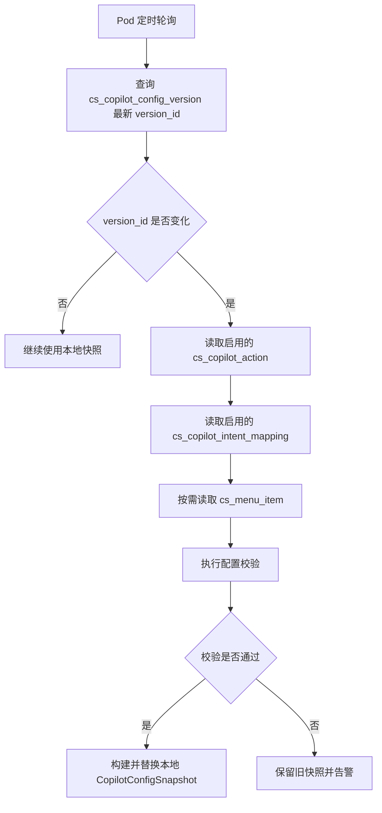
```mermaid
flowchart TD
    A[Pod 定时轮询] --> B[查询 cs_copilot_config_version 最新 version_id]
    B --> C{version_id 是否变化}
    C -- 否 --> D[继续使用本地快照]
    C -- 是 --> E[读取启用的 cs_copilot_action]
    E --> F[读取启用的 cs_copilot_intent_mapping]
    F --> G[按需读取 cs_menu_item]
    G --> H[执行配置校验]
    H --> I{校验是否通过}
    I -- 是 --> J[构建并替换本地 CopilotConfigSnapshot]
    I -- 否 --> K[保留旧快照并告警]
```

### 22.4 取值规则

| 场景 | 运行时目标来源 | 参数来源 | action 目标字段用途 |
|------|---------------|----------|--------------------|
| `menu_item_id` 为空 | `cs_copilot_action` | `param_config_json` | 必填，作为事实来源 |
| `menu_item_id` 不为空 | 前端现有快捷导航逻辑 | 快捷导航既有逻辑 | 可为空或作为快照，不作为事实来源 |

关联菜单项时，前端指令只携带 `menuItemId`，由前端复用现有快捷导航打开逻辑。服务端不把 `cs_menu_item.url/page_id/page_title/sys_flag` 翻译成 Copilot 跳转字段。

### 22.5 校验规则

发布校验和服务刷新校验应保持一致：

| 校验项 | 纯 action | 关联 item 的 action |
|--------|-----------|---------------------|
| action 启用状态 | `enabled='Y'` | `enabled='Y'` |
| 意图映射 | mapping 必须引用存在且启用的 action | 同左 |
| 目标字段 | `target_kind/open_mode` 必填，并校验组合合法 | 不要求 action 目标字段必填 |
| URL 白名单 | URL / IFRAME / NEW_WINDOW 必须命中白名单 | 不校验，沿用现有快捷导航打开链路 |
| 菜单项存在性 | 不校验 | `cs_menu_item.item_id` 必须存在 |
| 菜单项启用状态 | 不校验 | `cs_menu_item.enabled` 必须为 `Y` |
| 快照一致性 | 不校验 | `item_snapshot_json` 不为空时比较 itemName/url/sysFlag/pageId/pageTitle/enabled |
| 参数来源 | 校验 `param_config_json` 格式 | 不校验，沿用现有快捷导航打开链路 |

校验失败策略：

- 配置后台发布时：阻断发布，返回具体错误。
- 服务运行时刷新时：保留上一版有效快照；如果只存在少量失效 action，可按配置决定整版失败或跳过失效 action。MVP 建议整版失败，避免各 Pod 看到不同候选集。

### 22.6 已确认与待澄清问题

| 编号 | 问题 | 建议默认值 |
|------|------|------------|
| C1 | 前端是否支持仅凭 `menuItemId` 调用现有快捷导航打开逻辑？ | 已确认支持；关联 item 时指令只传 `menuItemId` |
| C2 | `cs_menu_item.enabled` 的真实启用值是什么？ | 已确认启用值为 `Y` |
| Q1 | `item_snapshot_json` 是否必填？ | 建议非必填；需要审计和防漂移时再启用 |
| Q2 | 菜单项变化后是否自动触发 Copilot 版本发布？ | 建议触发；否则 Copilot 可能继续使用旧快照直到下一次手工发布 |
| Q3 | 运行时发现单个 action 关联 item 失效时，是整版失败还是跳过单个 action？ | MVP 建议整版失败，保障一致性 |
| Q4 | 纯 action 的 `target_kind/open_mode` 是否允许继续扩展 COMPONENT/POPUP/DRAWER？ | 本期建议只支持 URL / ROUTE / IFRAME / NEW_WINDOW |
| Q5 | 纯 action 没有 `menuItemId` 时，前端业务权限如何判断？ | 建议本期通过 Copilot 配置、灰度白名单和目标 URL 白名单控制；若需细粒度权限，新增 action 级权限模型 |

---

# 第五篇 接口设计

## 23. 核心接口清单

| 编号 | 接口 | 方向 | 说明 |
|------|------|------|------|
| API-1 | WebSocket 推送指令 | Copilot → 前端 | 推荐卡片推送 |
| API-2 | POST /copilot/feedback | 前端 → Copilot | 反馈采集 |
| API-3 | POST /copilot/session/bind | 前端 → Copilot | 来电弹屏绑定 |
| API-4 | POST /copilot/session/unbind | 前端 → Copilot | 通话结束解绑 |
| API-5 | POST /copilot/admin/config/refresh | Admin → Copilot | 配置刷新 |
| API-6 | AI 意图识别 getSopResult.json | Copilot → AI | Feign 外部调用 |

---

## 24. 推送指令规范（API-1）

### 24.1 通信通道

```
通道：复用工作台已有 WebSocket
订阅地址：/user/{operatorId}/copilot/directive
消息方向：Copilot Service → 前端
```

### 24.2 完整指令 JSON 示例

```json
{
  "directiveId": "D_202604240001_a3b9c8",
  "directiveType": "RECOMMENDATION",
  "callId": "CALL_202604240001",
  "operatorId": "ho212121",
  "configVersion": "20260424.001",
  "expireAt": "2026-04-24T10:01:30.000Z",

  "intent": {
    "intentCode": "INTENT_TRAVEL_DECLARE",
    "intentName": "境外行程报备"
  },

  "function": {
    "actionId": "act_travel_declare",
    "actionName": "境外行程报备",
    "menuItemId": 12345,
    "functionPath": "信用卡风险侦测系统-参数设置-行程报备登记"
  },

  "display": {
    "title": "识别到：境外行程报备",
    "tip": "您正离开信用卡客服系统，联动至信用卡风险侦测系统",
    "iconUrl": "icons/travel.png"
  },

  "action": {
    "targetSource": "MENU_ITEM",
    "actionType": "OPEN_MENU_ITEM"
  },

  "risk": {
    "riskLevel": "MEDIUM",
    "needConfirm": true
  }
}
```

### 24.3 字段说明

| 字段 | 类型 | 必填 | 说明 |
|------|------|------|------|
| directiveId | string | 是 | 唯一标识，前端去重 |
| directiveType | string | 是 | RECOMMENDATION / WEAK_HINT |
| callId | string | 是 | 前端校验是否当前通话 |
| operatorId | string | 是 | 前端校验是否当前坐席 |
| configVersion | string | 是 | 前端可上报便于 Bad Case 复现 |
| expireAt | string | 是 | ISO 8601 时间，前端校验过期不执行 |
| intent.intentCode | string | 是 | AI 返回的意图代码 |
| intent.intentName | string | 是 | 意图名称 |
| function.actionId | string | 是 | Copilot action ID |
| function.actionName | string | 是 | Copilot 动作名称 |
| function.menuItemId | number | 否 | 关联菜单项；为空表示纯 action |
| function.functionPath | string | 否 | 功能路径（用于卡片展示） |
| display.title | string | 是 | 卡片标题 |
| display.tip | string | 否 | 跳转前提示 |
| display.iconUrl | string | 否 | 图标 URL |
| action.targetSource | string | 是 | ACTION / MENU_ITEM |
| action.targetKind | string | 条件必填 | ACTION 场景必填；URL/ROUTE/IFRAME/NEW_WINDOW |
| action.openMode | string | 条件必填 | ACTION 场景必填；CURRENT_TAB/NEW_TAB/WINDOW/IFRAME |
| action.actionType | string | 是 | 派生字段，前端按此选择执行器；MENU_ITEM 场景为 OPEN_MENU_ITEM |
| action.url | string | 否 | 含 `${COOKIE.xxx}` 占位符的 URL |
| action.params | object | 否 | 参数 map（值含 `${COOKIE.xxx}`） |
| risk.riskLevel | string | 是 | LOW/MEDIUM/HIGH |
| risk.needConfirm | boolean | 是 | 派生：MEDIUM/HIGH 时为 true |

### 24.4 directiveType 枚举

| directiveType | 含义 | 前端处理 |
|--------------|------|---------|
| RECOMMENDATION | 推荐打开 | 展示推荐卡片 |
| WEAK_HINT | 弱提示 | 侧边栏小图标 |

---

## 25. 反馈接口（API-2）

### 25.1 接口规范

```
POST /copilot/feedback
Content-Type: application/json
Authorization: Bearer {token}
```

### 25.2 请求

```json
{
  "directiveId": "D_202604240001_a3b9c8",
  "callId": "CALL_202604240001",
  "operatorId": "ho212121",
  "feedbackType": "ACCEPTED",
  "intentCode": "INTENT_TRAVEL_DECLARE",
  "intentName": "境外行程报备",
  "actionId": "act_travel_declare",
  "menuItemId": 12345,
  "feedbackTime": "2026-04-24T10:01:15.000Z"
}
```

#### 字段说明

| 字段 | 类型 | 必填 | 说明 |
|------|------|------|------|
| directiveId | string | 是 | 来自推送指令 |
| callId | string | 是 | 通话 ID |
| operatorId | string | 是 | 坐席工号 |
| feedbackType | string | 是 | ACCEPTED / IGNORED / WRONG_INTENT / WRONG_FUNCTION |
| intentCode | string | 是 | 推送时的 intentCode |
| intentName | string | 否 | 意图名称 |
| actionId | string | 是 | Copilot action ID |
| menuItemId | number | 否 | 关联菜单项 |
| feedbackTime | string | 是 | ISO 8601 时间 |

### 25.3 响应

成功：

```json
{
  "code": "0000",
  "message": "OK"
}
```

失败：

```json
{
  "code": "4000",
  "message": "Invalid feedbackType",
  "details": "feedbackType must be one of: ACCEPTED, IGNORED, WRONG_INTENT, WRONG_FUNCTION"
}
```

### 25.4 幂等性

```
按 directiveId 幂等控制：
  - 同一 directiveId 多次反馈：以首次为准
  - 后续反馈记录但不更新统计
  - 这避免前端重发或网络重试造成的重复计数
```

---

## 26. 通话会话接口（API-3、API-4）

### 26.1 绑定接口

```
POST /copilot/session/bind
```

请求：

```json
{
  "callId": "CALL_202604240001",
  "operatorId": "ho212121",
  "customerId": "C20120315000123",
  "customerType": "VIP3",
  "sessionStartTime": "2026-04-24T10:00:00.000Z"
}
```

字段说明：

| 字段 | 类型 | 必填 | 说明 |
|------|------|------|------|
| callId | string | 是 | 通话 ID |
| operatorId | string | 是 | 坐席工号 |
| customerId | string | 否 | 客户号（来电弹屏获取） |
| customerType | string | 否 | 客户类型 |
| sessionStartTime | string | 否 | 通话开始时间 |

响应：

```json
{ "code": "0000" }
```

### 26.2 解绑接口

```
POST /copilot/session/unbind
```

请求：

```json
{ "callId": "CALL_202604240001" }
```

调用时机：通话结束时由前端调用，触发清理对话历史、executedSteps、callSession、防抖 timer 等。

---

## 27. Admin 配置接口（API-5）

### 27.1 配置刷新

```
POST /copilot/admin/config/refresh
Authorization: Bearer {admin-token}
```

响应：

```json
{
  "code": "0000",
  "currentVersion": "20260424.001",
  "loadTimeMs": 145,
  "intentMappingCount": 87,
  "copilotEnabledItemCount": 32
}
```

### 27.2 健康检查

```
GET /copilot/health
```

响应：

```json
{
  "status": "UP",
  "configVersion": "20260424.001",
  "intentTreeVersion": "TREE_FIXED_V1",
  "uptime": 86400,
  "details": {
    "kafka": "UP",
    "redis": "UP",
    "ai": "UP"
  }
}
```

---

## 28. 外部接口对接

### 28.1 AI 意图识别（API-6）— Feign

```
POST {copilot.ai.url}/AICSCopilotReplyGen/getSopResult.json
Content-Type: application/json
```

#### 请求示例

```json
{
  "sessionId": "CALL_202604240001",
  "requestId": "req_20260424_001234_a3b9c8",
  "history": [
    {
      "id": "ASR_SEG_10086",
      "role": "user",
      "content": "我下周要去日本旅游",
      "contentType": "text",
      "createTime": "2026-04-24 10:01:01"
    }
  ],
  "executedSteps": [],
  "intentTree": { "...": "..." },
  "treeVersion": "TREE_FIXED_V1"
}
```

注：history 已经过 M06 过滤，**只含 speakerRole=CUSTOMER 的消息**。

#### 响应示例

```json
{
  "respCode": "1000",
  "respMsg": "成功",
  "data": {
    "sessionId": "CALL_202604240001",
    "requestId": "req_20260424_001234_a3b9c8",
    "intentName": "境外行程报备",
    "intentCode": "INTENT_TRAVEL_DECLARE",
    "clarifyContent": null,
    "llmResults": []
  }
}
```

#### 字段使用

| 字段 | 是否使用 |
|------|---------|
| `data.intentCode` | ✅ |
| `data.intentName` | ✅ |
| `data.clarifyContent` | ❌（澄清不做） |
| `data.llmResults` | ❌（SOP 决策不做） |

---

## 29. 错误码

### 29.1 通用错误码

| code | HTTP | 含义 |
|------|------|------|
| 0000 | 200 | 成功 |
| 4000 | 400 | 请求参数错误 |
| 4010 | 401 | 未鉴权 |
| 4030 | 403 | 无权限 |
| 5000 | 500 | 内部错误 |

### 29.2 业务错误码

| code | 含义 |
|------|------|
| COP_INTENT_NOT_MAPPED | AI 返回的 intentCode 在映射表中找不到 |
| COP_RISK_DISABLED | 风险等级 DISABLED，不展示 |
| COP_PARAM_MISSING | 必填参数缺失 |
| COP_URL_VALIDATION_FAIL | URL 白名单校验失败 |
| COP_AI_TIMEOUT | AI 接口超时 |
| COP_AI_FAILED | AI 接口业务失败 |
| COP_CONFIG_VERSION_STALE | 配置版本不一致 |

### 29.3 错误响应示例

```json
{
  "code": "COP_PARAM_MISSING",
  "message": "Required parameter missing: custNo",
  "details": {
    "actionId": "act_travel_declare",
    "menuItemId": 12345,
    "missingParams": ["custNo"]
  }
}
```

---
# 第六篇 关键流程

## 30. 端到端时序图

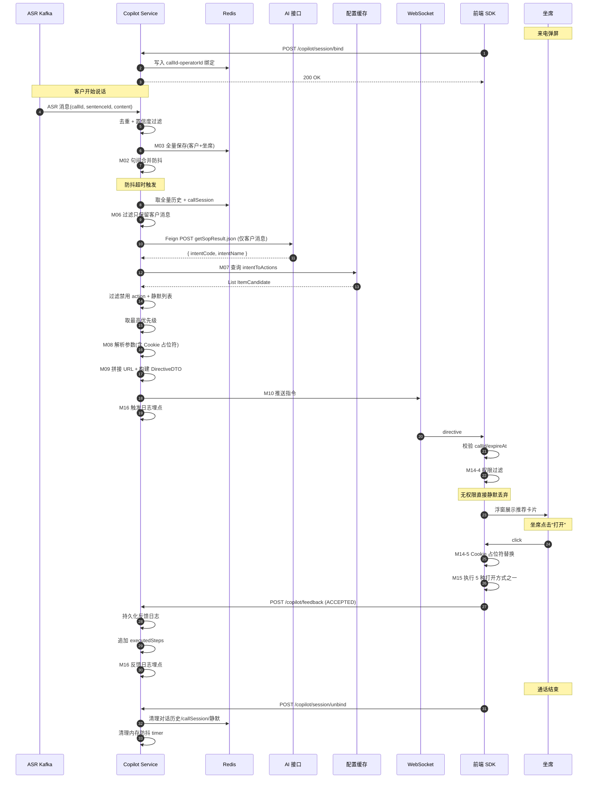
```mermaid
sequenceDiagram
    autonumber
    participant ASR as ASR Kafka
    participant SVC as Copilot Service
    participant Redis
    participant AI as AI 接口
    participant CFG as 配置缓存
    participant WS as WebSocket
    participant FE as 前端 SDK
    participant OP as 坐席

    Note over OP: 来电弹屏
    FE->>SVC: POST /copilot/session/bind
    SVC->>Redis: 写入 callId-operatorId 绑定
    SVC-->>FE: 200 OK

    Note over ASR,SVC: 客户开始说话
    ASR->>SVC: ASR 消息(callId, sentenceId, content)
    SVC->>SVC: 去重 + 置信度过滤
    SVC->>Redis: M03 全量保存(客户+坐席)
    SVC->>SVC: M02 句间合并防抖

    Note over SVC: 防抖超时触发
    SVC->>Redis: 取全量历史 + callSession
    SVC->>SVC: M06 过滤只保留客户消息
    SVC->>AI: Feign POST getSopResult.json (仅客户消息)
    AI-->>SVC: { intentCode, intentName }

    SVC->>CFG: M07 查询 intentToActions
    CFG-->>SVC: List ItemCandidate
    SVC->>SVC: 过滤禁用 action + 静默列表
    SVC->>SVC: 取最高优先级
    SVC->>SVC: M08 解析参数(含 Cookie 占位符)
    SVC->>SVC: M09 拼接 URL + 构建 DirectiveDTO
    SVC->>WS: M10 推送指令
    SVC->>SVC: M16 触发日志埋点

    WS->>FE: directive
    FE->>FE: 校验 callId/expireAt
    FE->>FE: M14-4 权限过滤
    Note over FE: 无权限直接静默丢弃

    FE->>OP: 浮窗展示推荐卡片

    Note over OP: 坐席点击"打开"
    OP->>FE: click
    FE->>FE: M14-5 Cookie 占位符替换
    FE->>FE: M15 执行 5 种打开方式之一
    FE->>SVC: POST /copilot/feedback (ACCEPTED)
    SVC->>SVC: 持久化反馈日志
    SVC->>SVC: 追加 executedSteps
    SVC->>SVC: M16 反馈日志埋点

    Note over OP: 通话结束
    FE->>SVC: POST /copilot/session/unbind
    SVC->>Redis: 清理对话历史/callSession/静默
    SVC->>SVC: 清理内存防抖 timer
```

---

## 31. 配置发布流程

```mermaid
sequenceDiagram
    autonumber
    participant Admin as 配置后台
    participant DB as 数据库
    participant Pub as Copilot 配置发布服务
    participant SVC as Copilot Service

    Admin->>DB: 编辑 cs_copilot_action
    Note over DB: 活表数据更新
    Admin->>DB: 编辑 cs_copilot_intent_mapping
    Admin->>Pub: 点击"发布 Copilot 配置"

    Pub->>DB: 读取 cs_copilot_action WHERE enabled='Y'
    Pub->>DB: 读取 cs_copilot_intent_mapping WHERE enabled='Y'
    Pub->>DB: 按需读取 cs_menu_item

    Pub->>Pub: 执行 action / mapping / item 一致性校验
    Pub->>DB: INSERT INTO cs_copilot_config_version

    Pub->>SVC: POST /copilot/admin/config/refresh
    SVC->>DB: 查询最新 cs_copilot_config_version
    SVC->>DB: 读取 action / mapping / item
    SVC->>SVC: 内存中重建 CopilotConfigSnapshot
    SVC-->>Pub: 200 OK

    Pub-->>Admin: 发布成功
```

菜单发布流程与 Copilot 配置发布流程解耦：

- 菜单发布继续写 `cs_menu_version.config_data`。
- Copilot 发布只写 `cs_copilot_config_version`，不修改菜单 CLOB。
- 如果某个 action 关联 `menu_item_id`，发布服务只读取菜单表做一致性校验；运行时打开也以菜单表配置为准。

---

# 第七篇 部署与运维

## 32. 部署架构

```mermaid
graph TB
    subgraph "Copilot Service Pods"
        P1[Pod 1]
        P2[Pod 2]
        P3[Pod N]
    end
    subgraph 共享存储
        REDIS[(Redis 集群)]
        DB[(存量数据库)]
    end
    subgraph 外部
        AI[AI 接口]
        KAFKA[Kafka]
        WS[WebSocket Gateway]
    end

    KAFKA -.按 callId 分区.-> P1
    KAFKA -.按 callId 分区.-> P2
    KAFKA -.按 callId 分区.-> P3
    P1 -.读写.-> REDIS
    P2 -.读写.-> REDIS
    P3 -.读写.-> REDIS
    P1 -.只读.-> DB
    P2 -.只读.-> DB
    P3 -.只读.-> DB
    P1 -.Feign.-> AI
    P2 -.Feign.-> AI
    P3 -.Feign.-> AI
    P1 -.推送.-> WS
    P2 -.推送.-> WS
    P3 -.推送.-> WS
```

### 32.1 关键运维事项

| 项 | 配置 |
|----|------|
| Pod 副本数 | ≥ 3，按高峰 4 通/秒预留 |
| 滚动发布 | 保证至少 1 个 Pod 可服务 |
| Kafka 分区 | ≥ Pod 数 × 2，按 callId 哈希分区 |
| Redis 集群 | 高可用，TTL 自动清理 |
| Copilot 配置重新加载 | 通过 Admin 接口触发，并由版本轮询兜底，不重启服务 |

---

## 33. Spring 配置项

```yaml
spring:
  application:
    name: cs-copilot-service

  kafka:
    bootstrap-servers: ${KAFKA_BROKERS}
    consumer:
      group-id: copilot-asr-consumer
      auto-offset-reset: latest
      enable-auto-commit: false

  redis:
    cluster:
      nodes: ${REDIS_NODES}
    timeout: 2000ms

  cloud:
    openfeign:
      client:
        config:
          ai-intent-client:
            connect-timeout: 1000
            read-timeout: 3000
            logger-level: BASIC

copilot:
  # ASR 接入
  asr:
    topic: cs.asr.sentences
    concurrency: 4
    min-text-length: 4
    asr-confidence-threshold: 0.65

  # 防抖参数
  debounce:
    complete-ms: 500
    neutral-ms: 1500
    incomplete-ms: 3000
    silence-ms: 2000

  # 意图树（配置文件）
  intent-tree:
    file: classpath:intent-tree.json
    version: TREE_FIXED_V1

  # AI 接口
  ai:
    url: http://aicscopilotreplygensop.sk.aipower3.cmbchina.cn
    connect-timeout-ms: 1000
    read-timeout-ms: 3000

  # URL 白名单
  url-whitelist: frdctrfront.paas.cmbchina.cn,mccusweb.paas.cmbchina.cn

  # 单通话限制
  call-limits:
    max-ai-calls: 50
    max-history-size: 50
    intent-cooldown-sec: 60
```

---

## 34. 容量估算

```
日通话量：       20,000 通
单通话平均：     8 句客户消息 / 6 句坐席消息
日 ASR 消息：    280,000 条（含坐席）

意图识别调用（防抖合并后）：60,000-80,000 次/日
高峰小时：    12,000 次/小时 ≈ 3.3 次/秒
峰值：        5 次/秒

WebSocket 在线连接： ~500 个（活跃坐席）
Copilot 快照大小：   ~100KB（Top 30）

Redis 容量：
  对话历史（含坐席）： 1.5GB
  callSession 绑定：  10MB
  执行步骤：          100MB
  静默列表：          50MB
  共计：              ~1.7GB

数据库表
  cs_copilot_action             ~50 行
  cs_copilot_intent_mapping     ~80 行
  cs_copilot_config_version     按发布次数增长
  cs_copilot_trigger_log        日增 ~80,000 条
  cs_copilot_feedback_log       日增 ~50,000 条
```

### 34.1 数据保留策略

| 数据 | 保留期 | 备注 |
|------|--------|------|
| Redis 对话历史 | 1 小时 | 通话结束后清理 |
| Redis callSession | 通话结束 + 30 分钟 | |
| Redis 静默列表 | 通话结束 | |
| 触发日志 | 90 天 | 后续按行内合规调整 |
| 反馈日志 | 1 年 | 后续按行内合规调整 |

---

## 35. 业务监控指标

> DD-V1.1 调整：应用日志、接口监控用行内已有基础设施，本节仅描述业务面监控的落库字段。**不做看板**，看板留待 F10/F11 实现。

### 35.1 业务面埋点（仅落库）

#### 触发日志埋点（M07 + M16）

每次意图识别后落 `cs_copilot_trigger_log` 一行记录：

```
意图识别成功 → 落库 1 行
  - intent_code: 实际识别的意图
  - action_id: 匹配到的 Copilot 动作（NULL=无映射）
  - menu_item_id: 可选关联菜单项
  - candidate_count: 候选总数
  - directive_id: 推送的指令 ID

意图识别失败 → 落库 1 行
  - intent_code: NULL
  - result_status: FAIL
```

#### 反馈日志埋点（M11 + M16）

每次反馈落 `cs_copilot_feedback_log` 一行：

```
所有反馈类型都落库：
  - feedback_type: ACCEPTED / IGNORED / WRONG_INTENT / WRONG_FUNCTION
  - directive_id: 关联触发日志
```

### 35.2 后续看板（F10/F11）能基于已有埋点实现

```sql
-- 采纳率（基于本期埋点可直接计算）
SELECT
    COUNT(CASE WHEN feedback_type = 'ACCEPTED' THEN 1 END) * 1.0
        / COUNT(directive_id) AS accept_rate
FROM cs_copilot_trigger_log t
LEFT JOIN cs_copilot_feedback_log f ON t.directive_id = f.directive_id
WHERE t.trigger_time >= DATE '2026-04-24';

-- 无映射意图 TopN
SELECT intent_code, COUNT(*) AS no_mapping_count
FROM cs_copilot_trigger_log
WHERE action_id IS NULL
GROUP BY intent_code
ORDER BY no_mapping_count DESC
LIMIT 10;

-- Action 采纳率
SELECT t.action_id,
       COUNT(CASE WHEN f.feedback_type = 'ACCEPTED' THEN 1 END) * 1.0
           / NULLIF(COUNT(t.directive_id), 0) AS accept_rate
FROM cs_copilot_trigger_log t
LEFT JOIN cs_copilot_feedback_log f ON t.directive_id = f.directive_id
WHERE t.trigger_time >= NOW() - INTERVAL '1 day'
GROUP BY t.action_id;
```

### 35.3 应用日志与接口监控

```
按行内基础设施落地：
  ✓ 应用日志：行内统一日志平台
  ✓ 接口监控（HTTP 调用、耗时、失败率）：行内 APM 系统
  ✓ Kafka 消费监控：行内 Kafka 监控

Copilot Service 端：
  - 日志按行内规范输出（详见 36 章）
  - HTTP 接口暴露 Spring Actuator 指标
  - 不单独建监控基础设施
```

---

## 36. 日志规范

### 36.1 日志级别

| 级别 | 使用场景 |
|------|----------|
| ERROR | 系统异常（影响功能） |
| WARN | 外部接口失败、配置异常等可恢复问题 |
| INFO | 关键流程节点（意图识别成功、推荐推送、反馈采纳） |
| DEBUG | 详细参数、中间结果（默认关闭） |

### 36.2 关键日志格式

```json
{
  "timestamp": "2026-04-24T10:01:05.123Z",
  "level": "INFO",
  "logger": "IntentRecognitionTrigger",
  "message": "Intent recognized",
  "callId": "CALL_001",
  "operatorId": "ho212121",
  "intentCode": "INTENT_TRAVEL_DECLARE",
  "intentName": "境外行程报备",
  "aiDurationMs": 480,
  "candidateCount": 1,
  "configVersion": "20260424.001"
}
```

### 36.3 traceId 关联

```
全链路 traceId 规则：
  - Kafka 消息 → ASR 系统生成或 Copilot 入口生成
  - HTTP 请求 → X-Trace-Id Header 传递
  - WebSocket 推送 → directiveId 即 traceId
  - 反馈接口 → 复用 directiveId
```

### 36.4 简化说明

```
按行内合规要求适配脱敏方案（本期不做）：
  ✗ ASR 历史敏感字段脱敏
  ✗ 加密存储审计日志
```

---

# 第八篇 代码可维护性

## 37. 工程结构

```
cs-copilot-service/
├── pom.xml
├── src/main/java/com/bank/cs/copilot/
│   ├── CopilotApplication.java
│   │
│   ├── api/                         # 内部接口层
│   │   ├── controller/
│   │   │   ├── FeedbackController.java
│   │   │   ├── SessionController.java
│   │   │   └── AdminController.java
│   │   └── dto/
│   │
│   ├── core/                        # 核心业务编排
│   │   ├── intent/
│   │   │   ├── IntentRecognitionTrigger.java
│   │   │   ├── IntentRecognitionClient.java
│   │   │   ├── IntentTreeLoader.java
│   │   │   └── ExecutedStepsManager.java
│   │   ├── match/
│   │   │   ├── IntentFunctionMatcher.java
│   │   │   ├── RuleEvaluator.java
│   │   │   └── JsonRuleEvaluator.java
│   │   ├── param/
│   │   │   ├── ParamResolver.java
│   │   │   └── StandardParamType.java
│   │   ├── directive/
│   │   │   ├── DirectiveBuilder.java
│   │   │   └── UrlBuilder.java
│   │   └── feedback/
│   │       ├── FeedbackService.java
│   │       └── MuteListManager.java
│   │
│   ├── asr/                         # ASR 接入层
│   │   ├── AsrSentenceConsumer.java
│   │   ├── SentenceMerger.java
│   │   ├── SentenceContinuityDetector.java
│   │   └── DialogHistoryManager.java
│   │
│   ├── session/                     # 通话会话
│   │   └── CallSessionManager.java
│   │
│   ├── push/                        # 推送
│   │   └── CopilotPushService.java
│   │
│   ├── config/                      # 配置缓存
│   │   ├── CopilotConfigCache.java
│   │   └── CopilotConfigRepository.java
│   │
│   ├── infra/                       # 基础设施
│   │   ├── feign/                   # DD-V1.1: Feign 配置
│   │   │   ├── AiIntentFeignClient.java
│   │   │   └── AiFeignConfig.java
│   │   ├── kafka/
│   │   ├── redis/
│   │   └── metrics/
│   │
│   ├── domain/                      # 领域模型
│   │   ├── ItemFullConfig.java
│   │   ├── CopilotExt.java
│   │   ├── IntentMapping.java
│   │   ├── DialogMessage.java
│   │   ├── CallSession.java
│   │   └── IntentResult.java
│   │
│   └── extension/                   # 扩展点（待实现模块预留）
│       ├── EntityExtractor.java
│       ├── ClarificationStrategy.java
│       ├── GrayPolicy.java
│       └── PermissionChecker.java   # DD-V1.1 新增（F13 用）
│
└── src/main/resources/
    ├── application.yml
    ├── application-uat.yml
    ├── application-prod.yml
    └── intent-tree.json
```

---

## 38. 扩展点设计

为后续待实现模块**显式预留扩展点**，避免大规模重构。

### 38.1 已预留的扩展点

```mermaid
graph LR
    Main[主流程] --> EE[EntityExtractor<br/>F02/F03 用]
    Main --> CS[ClarificationStrategy<br/>F04 用]
    Main --> GP[GrayPolicy<br/>F07 用]
    Main --> PC[PermissionChecker<br/>F13 用]

    EE --> NoOp1[本期: NoOpEntityExtractor]
    CS --> NoOp2[本期: NoOpClarificationStrategy]
    GP --> NoOp3[本期: AllowAllGrayPolicy]
    PC --> NoOp4[本期: AllowAllPermissionChecker]
```

### 38.2 实体抽取扩展点

```java
public interface EntityExtractor {
    Map<String, EntityValue> extract(
        List<DialogMessage> recentMessages,
        List<String> targetEntities);
}

@Component
@ConditionalOnMissingBean(EntityExtractor.class)
public class NoOpEntityExtractor implements EntityExtractor {
    @Override
    public Map<String, EntityValue> extract(
            List<DialogMessage> recentMessages,
            List<String> targetEntities) {
        return Collections.emptyMap();
    }
}
```

### 38.3 服务端权限校验扩展点（DD-V1.1 新增 F13）

虽然本期由前端控制权限，但预留扩展点以便后续启用：

```java
public interface PermissionChecker {
    PermissionResult check(String operatorId, String actionId, Long menuItemId);

    enum PermissionResult { ALLOW, DENY, UNKNOWN }
}

@Component
@ConditionalOnMissingBean(PermissionChecker.class)
public class AllowAllPermissionChecker implements PermissionChecker {
    @Override
    public PermissionResult check(String operatorId, String actionId, Long menuItemId) {
        return PermissionResult.ALLOW;  // 本期默认放行，前端控制
    }
}
```

后续 F13 启用时只需实现 `IamPermissionChecker` 注入到 Spring 容器即可，主流程代码不变。

### 38.4 扩展点设计原则

```
1. 接口先行
   每个扩展点用接口定义，避免直接暴露实现类

2. 默认空实现
   本期未实现的扩展点提供 NoOp/AllowAll 默认实现
   通过 @ConditionalOnMissingBean 让自定义实现自动覆盖

3. 不破坏主流程
   主流程调用扩展点，扩展点返回值为空时不影响主流程

4. 配置开关
   每个扩展点提供 Spring 配置开关，支持运行时启停
```

---

## 39. 单元测试覆盖

### 39.1 覆盖目标

| 模块类型 | 覆盖目标 |
|----------|---------|
| 核心业务（M02/M06/M07/M08/M09） | ≥ 80% |
| 基础设施（M01/M03/M04/M10） | ≥ 60% |
| DTO / 工具类 | 不强制 |

### 39.2 关键测试用例

```
M02 句间合并器
  ✓ 完整句立即触发(500ms)
  ✓ 待续句延迟触发(3000ms)
  ✓ 多句合并到一次触发
  ✓ 沉默 timer 正确重置
  ✓ 客户消息触发，坐席消息不触发

M03 对话历史（DD-V1.1 关键测试）
  ✓ 客户消息保存
  ✓ 坐席消息保存
  ✓ getHistory 返回全量（含坐席）

M06 AI Feign Client（DD-V1.1 关键测试）
  ✓ Feign 调用成功
  ✓ Feign 调用超时
  ✓ Feign 调用失败
  ✓ **过滤逻辑：只保留客户消息传给 AI**

M07 匹配引擎
  ✓ 单 intentCode 单 actionId
  ✓ 单 intentCode 多 actionId（priority 排序）
  ✓ 关联 menuItemId 的 action 可用性校验
  ✓ enabled=N 不返回
  ✓ DISABLED 风险等级不返回

M08 参数解析
  ✓ CUST_NO 从 session 取
  ✓ CALL_ID 从 callMeta 取
  ✓ EXP 字面值
  ✓ **COOKIE_PLACEHOLDER 输出 ${COOKIE.xxx} 占位符**
  ✓ 未知 paramType 跳过

M09 指令构建
  ✓ URL 拼接含 query
  ✓ URL 拼接 base 已含 ?
  ✓ 中文参数 URL 编码
  ✓ **${COOKIE.xxx} 占位符不做 URL 编码**
  ✓ actionType 正确派生
  ✓ 域名白名单拦截
```

### 39.3 集成测试

```
端到端集成测试（推荐 Spring Boot Test + Testcontainers）：
  - Embedded Kafka
  - Embedded Redis
  - WireMock 模拟 AI 接口

场景：
  ✓ 完整链路：ASR → 意图识别 → 推荐 → 反馈
  ✓ AI 失败 → 静默
  ✓ 配置刷新 → 内存切换
  ✓ 通话结束清理
  ✓ Cookie 占位符在 URL 中正确保留
```

---

# 第九篇 实施计划

## 40. 人天估算

### 40.1 模块分解（DD-V1.2 调整）

| 模块 | 工时（人日） | DD-V1.2 调整原因 |
|------|------------|------------------|
| 基础框架与脚手架 | 3 | - |
| M01 ASR 事件接入器 | 3 | 顺序调整（P0-7，0 工时变化） |
| M02 句间合并器 | 3 | confidence 缺失策略（P1-1，含 0.5）|
| M03 对话历史管理 | 2 | - |
| M04 callId-operatorId 绑定 | 1 | fail closed（P0-8，0 工时变化）|
| M05 意图树加载器 + 热加载 | 1.5 | + Admin 接口（P1-7）|
| M06 AI Feign Client + 熔断 + 过滤 + AI 计数 | 4 | + 熔断（P1-5），+ 计数（P1-4）|
| M07 意图-功能匹配引擎 + 灰度白名单 + 异常默认 false | 4 | + 灰度（P1-9），+ 异常处理（P1-19）|
| M08 参数解析器 + Cookie 受控 | 3 | + Cookie 白名单（P0-4）|
| M09 跳转指令构建器 + URL 多重校验 | 3 | + URL 校验（P0-5），+ 修复 bug（P1-12）|
| M10 WebSocket 推送 | 2 | - |
| M11 反馈接口 + 指令校验 + 幂等 + 静默列表 | 3.5 | + 指令校验（P0-6）|
| M12 Copilot 配置发布 + 发布前基础校验 | 4.5 | + action/mapping/item 校验（P1-8）|
| M13 Copilot 配置后台 | 6 | - |
| M14 前端 SDK + 权限 fail closed + 卡片频控 | 9 | + fail closed（P1-20），+ 频控（P2-12）|
| M15 五种打开方式 | 4 | - |
| M16 业务监控埋点 + 字段扩展 | 2.5 | + reason_code 等字段（P1-16）|
| M17 多 Pod 配置一致性轮询（DD-V1.2 新增 P1-17） | 0.5 | 新增 |
| **小计模块开发** | **59.5** | DD-V1.1 52 → +7.5 |
| 集成联调 | 6 | + 评审项验证（+1） |
| 测试（单测 + 集测） | 7 | + 安全场景测试（+2） |
| 文档与培训 | 2 | - |
| 与上游团队协调（P1-2 Kafka key、P1-18 版本语义）| 1 | DD-V1.2 新增 |
| **合计** | **75.5 人日** | DD-V1.1 64 → DD-V1.2 75.5（≈80）|

#### 工时增加汇总

| 评审项 | 增加工时 |
|-------|---------|
| P0-6 反馈指令校验 + 幂等 | +1.5 |
| P0-4 Cookie 受控（前后端） | +1.5 |
| P0-5 URL 多重校验 | +1 |
| P1-5 熔断 | +1 |
| P1-7 意图树热加载 | +0.5 |
| P1-8 Copilot 配置发布前校验 | +1.5 |
| P1-9 灰度白名单 | +0 |
| P1-13 Cookie required/optional | +1 |
| P1-16 trigger_log 字段扩展 | +0.5 |
| P1-17 多 Pod 一致性 | +0.5 |
| P1-20 前端权限 fail closed | +0.5 |
| P2-12 前端卡片频控 | +1 |
| 集成联调 + 测试增加 | +3 |
| 协调上游 | +1 |
| **DD-V1.2 总增量** | **约 +14-16 人日** |

#### 周期影响

```
DD-V1.1 计划周期：8 周
DD-V1.2 调整后：10 周（延后 2 周）

主要在 Week 5-6 增加安全增强项的实施和测试时间。
```

### 40.2 业务团队工时

```
意图树梳理：2 人日
Top 30 功能映射配置：3 人日
合计：5 人日
```

---

## 41. 关键里程碑

```mermaid
gantt
    title MVP 实施里程碑
    dateFormat YYYY-MM-DD
    section 后端
    基础框架+数据模型      :a1, 2026-05-01, 5d
    ASR 链路打通         :a2, after a1, 5d
    AI 接入+匹配引擎      :a3, after a2, 5d
    指令构建+推送         :a4, after a3, 5d
    section 前端
    Copilot SDK 框架     :b1, after a2, 5d
    浮窗+权限+Cookie     :b2, after b1, 5d
    五种打开方式         :b3, after b2, 5d
    section 集成
    Top 30 配置          :c1, after a4, 5d
    端到端联调           :c2, after c1, 5d
    灰度上线             :c3, after c2, 5d
    全量上线             :c4, after c3, 5d
```

| 周 | 里程碑 | DD-V1.2 调整 |
|----|--------|--------------|
| Week 1 | 基础框架 + 数据模型上线（含扩展字段） | - |
| Week 2 | ASR 链路打通（M01-M04，**P0-7 顺序+P0-8 fail closed**） | 含安全调整 |
| Week 3 | AI 接入 + 匹配引擎（M05-M08，**P1-5 熔断+P0-4 Cookie 白名单**） | 含安全增强 |
| Week 4 | 推送 + 前端 SDK 端到端 Demo（**P0-5 URL 校验+P0-6 反馈校验+P1-20 fail closed**） | 含安全增强 |
| Week 5 | 配置后台 + Copilot 配置发布（M12 + M13，**P1-8 发布前校验**） | + 校验 |
| Week 6 | Top 30 配置 + 联调（**含 P1-9 灰度白名单+P1-17 多 Pod 一致性**） | 灰度准备 |
| Week 7 | **延长灰度（DD-V1.2 P2-15）** 1-2 名坐席先行 | 风险控制 |
| Week 8 | 灰度扩展（5-10 名坐席），观察 trigger_log 各 reason_code 分布 | 数据驱动 |
| Week 9 | 业务组灰度（约 20-30 名），调优 | DD-V1.2 新增 |
| Week 10 | 全量上线（一个业务组约 50 名） | 延后 2 周 |

---

# 第十篇 后续待实现清单

## 42. 待实现模块矩阵

| 编号 | 模块 | 优先级 | 工时（人日） | 说明 |
|------|------|-------|-----------|------|
| F01 | 二阶段页面自动化 | P1 | 70+ | 后续单独立项 |
| F02 | ASR 实体抽取（正则） | P1 | 5 | 通过 EntityExtractor 扩展点接入 |
| F03 | LLM 兜底实体抽取 | P2 | 5 | F02 完成后基础上 |
| F04 | 多卡列表澄清 | P2 | 8 | ClarificationStrategy 扩展点 |
| F05 | 数据脱敏框架（DD-V1.2 优先级提升至 P0） | **P0** | 8 | 行内合规要求确认后立即推进 |
| F06 | 配置编辑态/发布态拆分 | P2 | 5 | 配置规模或误删风险变高时 |
| F07 | 完整灰度发布机制 | P2 | 6 | GrayPolicy 扩展点（本期已做最简白名单）|
| F08 | 跨环境配置同步 | P3 | 8 | biz_key + env_map 表 |
| F09 | 完整配置沙箱（含 AI 评估） | P3 | 8 | 配置校验 + AI 评估两层（本期已做基础校验）|
| F10 | 业务效果看板 | P2 | 6 | 基于本期已埋点（含扩展字段）|
| F11 | 配置质量看板 | P3 | 4 | F10 完成基础上 |
| F12 | 意图树数据库化 | P3 | 4 | 意图树规模 > 200 节点时 |
| F13 | 服务端权限校验 | P3 | 5 | DD-V1.1 新增；PermissionChecker 扩展点 |
| **F14** | **URL 一次性 token 跳转**（DD-V1.2 新增）| **P2** | 10+ | 涉及目标系统改造 |
| **F15** | **Pod 重启 timer 持久化**（DD-V1.2 新增）| **P3** | 3 | 当前 TTL 兜底可接受 |

**合计**：约 95 人日（不含 F01 二阶段，DD-V1.2 含 F14/F15 新增）

---

## 43. 各模块详细规划

### 43.1 F01 二阶段页面自动化

**功能描述**：在坐席被导航到正确页面后，Copilot 根据客户语音和上下文，辅助完成页面内的查询、筛选、填写、定位等操作。

**与本期关联**：
- 复用 ASR 接入、意图识别、对话历史
- 复用 callId-operatorId 绑定
- 在指令推送层增加自动化指令类型

**依赖**：
- MVP 一阶段上线稳定 ≥ 1 个月
- 业务团队梳理自动化场景清单
- 前端 Vue 组件 data-copilot-id 标注

**优先级**：P1

### 43.2 F02 ASR 实体抽取（正则）

**功能描述**：从 ASR 文本中抽取卡号尾四位、账单月份、金额等业务实体。

**实现方式**：
- 实现 `RegexEntityExtractor` 注入扩展点
- 配置实体规则到新增 `cs_copilot_entity_extractor` 表
- 配置意图与实体的绑定关系

**与本期关联**：通过 `EntityExtractor` 扩展点接入，不修改 `ParamResolver` 主流程。

**优先级**：P1

### 43.3 F05 数据脱敏框架

**功能描述**：ASR 历史脱敏 + 日志脱敏 + 加密审计日志。

**依赖**：行内合规要求明确（保留期、脱敏字段范围）。

**优先级**：P1

### 43.4 F10 业务效果看板

**功能描述**：采纳率、推荐分布、坐席行为分析。

**实现方式**：
- 复用本期已埋点的 `cs_copilot_trigger_log` 和 `cs_copilot_feedback_log`
- 新建 BI 看板（Grafana / 内部 BI 工具）
- 不需要新增表

**与本期关联**：本期已落库的字段足够支撑后续看板。

**优先级**：P2

### 43.5 F13 服务端权限校验（DD-V1.1 新增）

**功能描述**：在前端权限的基础上，增加服务端的权限二次校验，作为安全加固。

**实现方式**：
- 实现 `IamPermissionChecker` 注入扩展点
- 不需要修改主流程代码

**触发条件**：
- 出现前端权限被绕过的安全事件
- 或：合规要求服务端必须做权限校验

**与本期关联**：本期已预留 `PermissionChecker` 扩展点。

**优先级**：P3

### 43.6 其他模块

F03/F04/F06/F07/F08/F09/F11/F12 详细规划与 DD-V1.0 一致，扩展接入路径已在第八篇预留。

---

# 附录

## 附录 A：术语表

| 术语 | 说明 |
|------|------|
| ASR | 自动语音识别 |
| intentCode | AI 团队维护的标准意图编码（字符串） |
| action_id | `cs_copilot_action` 表主键，Copilot 推荐和反馈的主业务标识 |
| item_id / menu_item_id | `cs_menu_item` 表主键；在 Copilot 中仅作为可选快捷导航关联 |
| 句间合并 | 多个 ASR 短句合并为一次意图查询的机制 |
| executedSteps | 已执行意图步骤，传给 AI 辅助决策 |
| 静默列表 | 单通话内不再推荐的意图/功能集合 |
| 菜单 CLOB | `cs_menu_version.config_data` 中的菜单发布快照，Copilot 不再向其中写入 `copilotIndex` |
| CopilotConfigSnapshot | Copilot Service 从独立配置表构建的本地不可变配置快照 |
| 反向索引 | CopilotConfigSnapshot 中的 `intentToActions` / `actionById` 等加速查询结构 |
| 扩展点 | 接口形式预留的扩展位置，本期空实现 |
| StandardParamType | 14 个标准参数枚举（DD-V1.1 新增 COOKIE_PLACEHOLDER） |
| Cookie 占位符 | URL 中的 `${COOKIE.xxx}`，由前端从 cookie 读取替换 |
| 全量保存 | M03 保存客户+坐席消息，过滤在 M06 |

---

## 附录 B：与 V3.3 评审稿的差异

| 维度 | V3.3 评审稿 | DD-V1.1 |
|------|-------------|---------|
| 文档定位 | 评审稿（含完整架构 + 评审采纳） | 开发详细设计稿 |
| 范围 | 一阶段 + 二阶段 | **仅一阶段 MVP** |
| 二阶段自动化 | 详细设计 | F01 待实现 |
| 实体抽取 | 正则 + LLM 完整方案 | F02/F03 待实现 |
| 澄清机制 | 三层结构 | F04 待实现 |
| 数据脱敏 | 完整方案 | F05 待实现 |
| 配置生命周期 | 编辑态/发布态双表 | enabled 单字段 |
| 灰度 | 双重灰度 | F07 待实现 |
| 跨环境同步 | biz_key + env_map | F08 待实现 |
| 沙箱 | 配置 + AI 评估 | F09 待实现 |
| 看板 | 业务 + 配置质量 | 仅落库，F10/F11 待实现 |
| 意图树 | 数据库 + 一键发布 | Spring 配置文件 |
| **服务端权限校验**（DD-V1.1） | IAM 接口校验 | **删除，前端控制；F13 待实现** |
| **外部接口客户端**（DD-V1.1） | RestTemplate | **Spring Cloud OpenFeign** |
| **URL 拼接**（DD-V1.1） | 服务端拼完整 URL | **服务端用占位符 + 前端补 Cookie** |
| **会话保存与过滤**（DD-V1.1） | 一起处理 | **保存全量 + 调 AI 时过滤** |
| **业务监控**（DD-V1.1） | 完整看板 | **仅落库，看板后续做** |
| 数据模型 | 10+ 张表 | 4 张新增表 |
| 工时（一阶段） | 60-65 人日 | 64 人日 |

### B.1 DD-V1.0 → DD-V1.1 关键变化

| 项 | DD-V1.0 | DD-V1.1 |
|----|---------|---------|
| M09 IAM 客户端 | 有 | 删除 |
| AI 接口客户端 | RestTemplate | Feign Client |
| 对话历史保存 | 客户+坐席 | 客户+坐席（明确"全量保存"语义） |
| AI 调用前过滤 | 未明确 | M06 调用前过滤只传客户 |
| Cookie 占位符 | 无 | ${COOKIE.xxx} 占位符 + 前端替换 |
| 业务监控 | 简略提及 | 结构化埋点字段详化 |
| 数据库 DDL | 简略 | 完整 DDL + 字段说明 |
| 接口设计 | 简略 | 完整 JSON 示例 + 字段表 + 错误码 |
| 待实现清单 | F01-F12 | F01-F13（新增 F13 服务端权限校验） |

### B.2 DD-V1.1 → DD-V1.2 关键变化

| 项 | DD-V1.1 | DD-V1.2 |
|----|---------|---------|
| M01 顺序 | 触发过滤前置 | **先存历史再触发判断（P0-7）** |
| callSession 缺失处理 | 用空 operatorId 推 | **fail closed 不推荐（P0-8）** |
| 反馈接口校验 | 仅幂等说明 | **directive_id UNIQUE + 服务端校验 + is_effective（P0-6）** |
| Cookie 占位符 | 名格式校验 | **白名单 + 域名绑定 + required/optional（P0-4 + P1-13）** |
| URL 校验 | 仅域名白名单 | **协议+域名+生产禁 UAT+同名冲突（P0-5）** |
| AI 接口保护 | 仅超时 | **+ Resilience4j 熔断（P1-5）+ 单通话计数（P1-4）** |
| 灰度 | 不做 | **最简 operatorId 白名单（P1-9）** |
| Copilot 配置发布 | 仅 enabled=Y | **+ action/mapping/item 基础校验门禁（P1-8）** |
| 意图树更新 | 重启加载 | **+ 热加载接口（P1-7）** |
| 多 Pod 一致性 | 单 Pod Admin 接口 | **+ 30s 轮询版本号（P1-17）** |
| 前端权限失败 | 未明确 | **fail closed（P1-20）** |
| 前端卡片 | 无频控 | **+ directiveId 去重 + intent 冷却 + 单通话上限（P2-12）** |
| trigger_log 字段 | 基础 | **+ action_id / menu_item_id / result_status / reason_code / filter_stage（P1-16）** |
| feedback_log 字段 | 基础 | **+ action_id / menu_item_id / is_effective（P1-14）** |
| operator_id 长度 | varchar(16) | **varchar(32)（P2-2）** |
| condition_rule | 配置可用 | **本期删除，复杂条件后续独立设计** |
| 评审采纳 | - | **附录 C 详细采纳清单** |
| 已知风险声明 | 隐含 | **2.3 节明示已知风险** |
| 待实现 | F01-F13 | **F01-F15（+F14 一次性 token, F15 timer 持久化）** |
| 工时 | 64 人日 | **75-80 人日（+12-16 人日）** |

---


---

## 附录 C：DD-V1.2 评审采纳清单

> 本附录详细列出 DD-V1.2 对专家评审 45 条建议的采纳情况。

### C.1 总体采纳情况

| 优先级 | 总数 | 完全采纳 | 部分采纳 | 合并采纳 | 不采纳 | 实际采纳率 |
|-------|-----|---------|---------|---------|--------|-----------|
| **P0** | 10 | 3 | 3 | 0 | 4 | 60% |
| **P1** | 20 | 13 | 3 | 3 | 1 | 95% |
| **P2** | 15 | 11 | 1 | 2 | 2 | 87% |
| **合计** | **45** | **27** | **7** | **5** | **7** | **84%** |

### C.2 P0 级采纳详情

| 编号 | 评审建议 | 采纳情况 | 落地章节 |
|------|---------|---------|---------|
| P0-1 | 服务端权限校验完全删除风险高 | ⚠️ **部分采纳**：action 启用校验 + 关联 menuItem 校验 + callSession 必校验；权限快照不采纳 | M07 + 11.5 |
| P0-2 | 对话历史不脱敏 | ❌ **不采纳**：用户明确决策；F05 待实现 | 2.3 已知风险声明 |
| P0-3 | AI 调用未脱敏 | ❌ **不采纳**：同 P0-2 | 2.3 已知风险声明 |
| P0-4 | Cookie 占位符泄露风险 | ⚠️ **部分采纳**：白名单 + 域名绑定；同源校验已通过 URL 白名单兜底 | 15.2 Cookie 受控 |
| P0-5 | URL 安全校验过简 | ⚠️ **部分采纳**：https + UAT 拦截 + 同名策略；路径/key 白名单不做（过度设计）| 16.4 URL 多重校验 |
| P0-6 | 反馈接口缺指令校验 | ✅ **完全采纳** | 17 章 + 21.4/21.5 DDL |
| P0-7 | M01 顺序冲突全量保存 | ✅ **完全采纳** | 8.2 + 8.4 |
| P0-8 | callSession 缺失继续推荐不安全 | ✅ **完全采纳** | 11.5 fail closed |
| P0-9 | URL token 长期保存风险 | ⚠️ **部分采纳**：白名单限制；一次性 token F14 待实现 | 15.2 |
| P0-10 | 后端按 AI 意图生成推荐缺前置过滤 | ❌ **不采纳**：用户明确决策；性能开销在 5 TPS 量级可忽略 | 2.3 |

### C.3 P1 级采纳详情

| 编号 | 评审建议 | 采纳情况 | 落地章节 |
|------|---------|---------|---------|
| P1-1 | confidence 缺失 NPE | ✅ 完全采纳 | M01 8.4 triggerValid |
| P1-2 | Kafka 分区契约 | ✅ 完全采纳 | 协调 ASR 团队 |
| P1-3 | Pod 重启 timer 丢失 | ⚠️ 部分采纳：文档说明限制；持久化 F15 | 9.6 + F15 |
| P1-4 | max-ai-calls 未实现 | ✅ 完全采纳 | 13.3 单通话计数 |
| P1-5 | AI 缺熔断 | ⚠️ 部分采纳：仅熔断；不做限流/Bulkhead | 13.3 熔断保护 |
| P1-6 | 只传客户损失上下文 | ❌ **不采纳**：用户明确决策 | - |
| P1-7 | 意图树需热加载 | ✅ 完全采纳 | 12.3 热加载接口 |
| P1-8 | 配置发布缺校验 | ✅ 完全采纳 | M12 发布前基础校验 |
| P1-9 | 无灰度机制 | ✅ 完全采纳：最简坐席白名单 | 14.5 灰度白名单 |
| P1-10 | mapping_priority 重复 | ✅ 完全采纳：删除扩展表字段 | 21.2 DDL |
| P1-11 | 参数缺失 reason 缺失 | ✅ 合并采纳 → P1-16 | result_status / reason_code |
| P1-12 | UrlBuilder 尾部分隔符 bug | ✅ 完全采纳 | 16.4 |
| P1-13 | Cookie 缺失保留占位符 | ✅ 完全采纳：required/optional 区分 | 19.4 替换函数 |
| P1-14 | 反馈幂等未保证 | ✅ 合并采纳 → P0-6 + is_effective | 21.5 DDL |
| P1-15 | trigger-feedback 关联不稳定 | ✅ 合并采纳 → P0-6 + UNIQUE 索引 | 21.4 |
| P1-16 | 日志缺失败原因 | ✅ 完全采纳：result_status/reason_code 等 | 18.5 + 21.4 |
| P1-17 | Admin 刷新只刷单 Pod | ✅ 完全采纳：30s 轮询兜底 | M17 新增模块 |
| P1-18 | 配置版本语义不清 | ✅ 完全采纳：协调存量团队 | 14.2 |
| P1-19 | condition_rule 缺白名单 | ✅ 调整采纳：本期删除 condition_rule | 14.3 |
| P1-20 | 前端权限 API 不稳定 | ✅ 完全采纳 | 19.3 fail closed |

### C.4 P2 级采纳详情

| 编号 | 评审建议 | 采纳情况 | 落地章节 |
|------|---------|---------|---------|
| P2-1 | Top30 与 ext 50 行口径 | ✅ 完全采纳：文档说明 | 34 章 |
| P2-2 | operator_id 长度 16 偏短 | ✅ 完全采纳：改为 32 | 21 章 DDL |
| P2-3 | customer_id 敏感等级 | ⚠️ 部分采纳：文档标注；脱敏 F05 | 21.4 字段说明 |
| P2-4 | Map.of 不能 null | ✅ 完全采纳 | M04 callSession |
| P2-5 | Cookie 正则 \w+ 偏严 | ✅ 完全采纳：[A-Za-z0-9_.-]+ | 15.2 |
| P2-6 | params 编码语义不一 | ✅ 完全采纳：URL/Component 分别处理 | 19.4 |
| P2-7 | OPEN_URL location.href 风险 | ✅ 完全采纳：文档说明 | 19 + 配置后台校验 |
| P2-8 | 健康检查 AI 实时打 | ✅ 完全采纳：使用最近一次状态 | 27 章 |
| P2-9 | Feign body 日志风险 | ✅ 合并采纳 → 36 章日志规范 | 36 章 |
| P2-10 | AI 失败缺 reason 分类 | ✅ 合并采纳 → P1-16 result_status / reason_code | 18.5 + 21.5 |
| P2-11 | trigger_keywords 说明少 | ✅ 完全采纳 | 21.2 字段说明 |
| P2-12 | 前端缺频控去重 | ✅ 完全采纳 | 19.6 卡片频控 |
| P2-13 | CLOB itemById params 敏感 | ✅ 方案调整后消除：Copilot 不再写入菜单 CLOB | 22 章 |
| P2-14 | 通话结束依赖前端 unbind | ❌ **不采纳**：TTL 兜底足够 | - |
| P2-15 | Week8 全量上线激进 | ✅ 完全采纳：Week 9-10 灰度延长 | 41 章里程碑 |

### C.5 不采纳建议详细说明

#### P0-1（部分不采纳）+ P0-10：服务端权限快照

**评审建议**：增加最小权限快照或要求前端绑定时上传可访问 itemId 列表摘要。

**不采纳原因**：
1. 用户明确指示："权限校验由前端控制，服务端暂不校验"
2. 已列入 F13 待实现，扩展点 PermissionChecker 已预留
3. 性能影响在 5 TPS 量级可忽略

**已采纳的部分**：
- action 启用校验；关联菜单项时校验 menuItem 存在、启用且与快照一致
- callSession 必校验（与 P0-8 合并，详见 11.5）

#### P0-2 + P0-3：对话历史 / AI 调用脱敏

**评审建议**：实现轻量脱敏（手机号、卡号、身份证等）。

**不采纳原因**：
1. 用户明确指示："对话记录保存和传输暂时不用实现脱敏方案，因为保存在 Redis 中过期就没有了，调用行内大模型不用过度考虑数据安全"
2. 已列入 F05 待实现（DD-V1.2 优先级提升至 P0）
3. 已在 2.3 节明示风险，作为有意识决策

**缓解措施**：
- 文档中明确风险（2.3 节）
- F05 优先级从 P1 提升至 P0
- 上线前需评估数据敏感度并取得合规审批

#### P1-6：只传客户消息可能损失上下文

**评审建议**：改为可配置策略，部分场景传脱敏后的坐席消息。

**不采纳原因**：用户明确指示："只有客户的做意图识别"。

#### P2-13：CLOB itemById 中 params 敏感

**调整后结论**：Copilot 配置不再写入 `cs_menu_version.config_data`，也不再生成 `copilotIndex.itemById`。纯 action 参数来自 `cs_copilot_action.param_config_json`；关联菜单项时指令只传 `menuItemId`，由前端复用现有快捷导航打开逻辑，运行时不在 Copilot 配置快照中保存真实客户数据。

#### P2-14：通话结束依赖前端 unbind

**不采纳原因**：Redis TTL 已兜底（callSession 30 分钟、对话历史 1 小时）。新增 CTI 事件清理需要新增对接，属于过度设计。

### C.6 已知风险与评审建议的对应关系

> DD-V1.2 在 2.3 节新增"已知风险与待实现说明"章节，明确以下评审建议中**违背用户决策**的风险点。

| 已知风险 | 对应评审建议 | 长期解决 |
|---------|------------|---------|
| 对话历史含敏感原文 | P0-2 | F05 |
| AI 调用未脱敏 | P0-3 | F05 |
| 服务端不校验业务权限 | P0-1（部分）+ P0-10 | F13 |
| Cookie 占位符若误配高敏字段 | P0-9（长期方案） | F14 |
| Pod 重启 timer 丢失 | P1-3 | F15 |
| 配置发布基础校验非完整沙箱 | （评审未明确，DD-V1.2 主动声明） | F09 |

### C.7 评审结论建议

```
原评审结论：有条件通过。允许进入开发准备，但 P0 问题必须在编码前完成设计修订。

DD-V1.2 处理后建议：
  ✓ 评审 45 项中已采纳 39 项（27 完全 + 7 部分 + 5 合并）
  ✓ 不采纳 7 项均有明确说明（4 项违背用户决策、2 项过度设计、1 项理解有误）
  ✓ 工时增加 12-16 人日，周期延后 2 周
  ✓ 新增 F14 / F15 待实现项，扩展点已预留

  建议结论：可进入开发实施阶段。
  
  其中：
  - P0 全部修订完成（不采纳的 4 项已在 2.3 节明示风险）
  - P1 95% 采纳，不采纳的 1 项违背用户决策
  - P2 87% 采纳，不采纳的 2 项已说明
  
  上线前合规要求：
  - F05 数据脱敏框架（P0 优先级）
  - 行内合规审批（数据敏感度评估）
```

---


**文档结束**

> 本文档为 MVP 详细设计稿（DD-V1.2），对应 Top 30 功能上线版本。
> 基于专家评审 45 项建议落实 39 项（84% 采纳率）。
> 后续 15 项待实现功能均已规划接入路径，扩展点预留完整。
> 工时：64 → 75-80 人日（+12-16 人日），周期延后 2 周。
> 上线前必备：F05 数据脱敏 + 行内合规审批。
