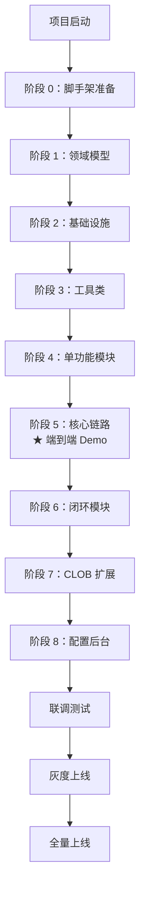

# 开发流程 SOP

> 本文档面向**项目开发者**，描述从立项到交付的完整开发流程。

## 整体流程图



## 阶段 0：脚手架准备（已完成）

✅ 当前状态：脚手架文件已就绪。

### 你需要做的

```bash
# 1. clone 项目到本地
git clone <repo-url> cs-copilot-service
cd cs-copilot-service

# 2. 验证构建
mvn clean compile

# 3. 启动本地 Redis 和 Kafka
docker run -d -p 6379:6379 redis
# 或用本地已有的 Redis

# 4. 启动应用
mvn spring-boot:run -Dspring-boot.run.profiles=dev
```

### 检查清单

- [ ] `mvn compile` 成功
- [ ] 应用能启动（不依赖外部资源时）
- [ ] 能访问 `GET /actuator/health`

## 阶段 1：领域模型

### 目标

完成 `domain` 包下所有 POJO 类，为后续模块提供数据结构。

### 操作

打开 Claude Code，使用以下 Prompt：

```
@CLAUDE.md @docs/dd-v1.2.md @docs/module-tasks.md

请实现 Task L1-1：领域模型 POJO

要求：
1. 按 docs/module-tasks.md 中 Task L1-1 的清单实现
2. 字段类型与 DD-V1.2 一致
3. 用 Lombok @Data + @Builder
4. 不需要业务方法
5. 完成后告诉我哪些文件创建了
```

### 验收

- [ ] 所有 POJO 创建完成
- [ ] `mvn compile` 通过
- [ ] 字段名规范（如 `intentCode` 不是 `intent_code`）

### Git 提交

```bash
git checkout -b feature/l1-domain-models
git add src/main/java/com/cmbchina/cs/assitsvc/domain/
git commit -m "[L1] 添加领域模型 POJO

- DialogMessage / IntentResult / DirectiveDTO 等
- 使用 Lombok @Data + @Builder

Refs: DD-V1.2 全文涉及"
git push origin feature/l1-domain-models
# 然后 GitLab 创建 MR
```

## 阶段 2：基础设施

### 目标

完成 Redis、Feign、Kafka、Metrics 配置类。

### 操作

每个 Task 单独让 Claude 实现：

```
@CLAUDE.md @docs/dd-v1.2.md @docs/module-tasks.md

请实现 Task I-1：Redis 配置

要求：
1. 用 JedisConnectionFactory（不是 Lettuce）
2. 配合 application.yml 中的 redis 配置
3. 创建 RedisTemplate<String, String> Bean
```

依次实现 I-1 → I-2 → I-3 → I-4。

### 验收

- [ ] 启动应用时连接 Redis 成功
- [ ] 能调通 WireMock 模拟的 AI 接口
- [ ] Kafka Consumer 启动无报错

### 关键检查点

**Redis 连接确认**：

```bash
redis-cli
> PING
PONG
> KEYS copilot:*
```

**Feign Client 确认**：用 WireMock 模拟 AI 接口

```java
// 启动 WireMock
WireMockServer wireMockServer = new WireMockServer(8081);
wireMockServer.start();

// 配置桩
wireMockServer.stubFor(post(urlEqualTo("/AICSCopilotReplyGen/getSopResult.json"))
    .willReturn(aResponse()
        .withStatus(200)
        .withBody("{\"respCode\":\"1000\",\"data\":{\"intentCode\":\"INTENT_BILL_QUERY\"}}")));
```

## 阶段 3：工具类

### 目标

完成 StandardParamType、UrlBuilder。

### 操作

```
@CLAUDE.md @docs/module-tasks.md

请实现 Task U-1：StandardParamType 枚举

要求：
1. 14 个枚举值（含 COOKIE_PLACEHOLDER）
2. 字段：displayName / sourceType / defaultSourceKey / sensitive
3. 严格按 DD-V1.2 第 15.1 节
```

依次实现 U-1 → U-2 → U-3。

## 阶段 4：单功能模块

### 目标

完成 M03 历史 + M04 callSession + M05 意图树。这三个模块都是独立的，不互相依赖。

### 操作

```
@CLAUDE.md @docs/dd-v1.2.md @docs/module-tasks.md

请实现 Task M03：对话历史管理

要求：
1. 按 docs/module-tasks.md 中 Task M03 清单
2. 严格遵循"全量保存"语义（不在这里过滤）
3. Redis List 存储，TTL 1 小时
```

## 阶段 5：核心链路（★ 项目第一个里程碑）

### 目标

跑通"ASR 消息 → 意图识别 → 推荐推送"的端到端链路。

### 操作

按顺序实现：M01 → M02 → M06 → M07 → M08 → M09 → M10。

**重要**：每个模块完成后，在本地跑一次集成验证：

```bash
# 1. 启动 Redis、Kafka、WireMock（AI 接口 Mock）
# 2. 启动 Copilot Service
mvn spring-boot:run -Dspring-boot.run.profiles=dev

# 3. 用 kafkacat 发送测试 ASR 消息
echo '{"callId":"CALL_001","sentenceId":"SEG_001","speakerRole":"CUSTOMER","content":"我要查询账单","confidence":0.95}' | kafkacat -P -b localhost:9092 -t cs.asr.sentences

# 4. 观察日志，确认完整链路通顺
```

### 验收（端到端 Demo）

- [ ] 客户消息能触发意图识别
- [ ] AI 返回意图后能匹配到候选功能
- [ ] 推荐指令能通过 WebSocket 推送
- [ ] 整个链路日志含 callId

### Git 里程碑

```bash
git tag -a v0.1-e2e-demo -m "端到端 Demo 完成"
git push origin v0.1-e2e-demo
```

## 阶段 6：闭环模块

### 目标

完成反馈接口、业务监控埋点、多 Pod 配置一致性。

### 操作

```
@CLAUDE.md @docs/dd-v1.2.md

请实现 Task M11：反馈接口（DD-V1.2 P0-6 关键修订）

要求：
1. 严格按 DD-V1.2 第 17 章 + 第 25 章
2. 通过 directive_id 反查 trigger_log 校验
3. 实现 is_effective 幂等控制（P1-14）
4. 用 RestController + @Valid
```

## 阶段 7：CLOB 扩展（协作存量团队）

### 目标

修改存量发布逻辑，让 CLOB 含 Copilot 字段。

### 注意

这个阶段**需要协调存量发布团队**，不是单方能完成的。

### 操作

1. 先和存量团队约时间，了解他们的发布逻辑代码位置
2. 让 Claude 生成"扩展位置"的代码片段，作为修改建议
3. 提 MR 给存量团队 review

## 阶段 8：配置后台

### 目标

完成 Admin 接口（配置刷新、意图树重载、健康检查）。

## 联调测试

### 联调清单

- [ ] 与 ASR 团队联调（Kafka 消息格式 + 分区 key）
- [ ] 与 AI 团队联调（getSopResult.json 真实接口）
- [ ] 与工作台前端联调（WebSocket + 反馈接口）
- [ ] 端到端通话测试（真实 CTI 来电）

## 灰度上线

按 DD-V1.2 第 41 章里程碑：

| 周 | 内容 |
|----|------|
| Week 7 | Top 30 配置 + 首批 1-2 名坐席灰度 |
| Week 8 | 扩展到 5-10 名坐席 |
| Week 9 | 业务组灰度（约 20-30 名） |
| Week 10 | 全量上线 |

### 灰度过程监控

每天查看：

```sql
-- 触发统计
SELECT result_status, reason_code, COUNT(*)
FROM cs_copilot_trigger_log
WHERE trigger_time > NOW() - INTERVAL '1 day'
GROUP BY result_status, reason_code
ORDER BY 3 DESC;

-- 采纳率
SELECT
    COUNT(CASE WHEN feedback_type = 'ACCEPTED' THEN 1 END) * 1.0
        / COUNT(directive_id) AS accept_rate
FROM cs_copilot_trigger_log t
LEFT JOIN cs_copilot_feedback_log f ON t.directive_id = f.directive_id
WHERE t.trigger_time > NOW() - INTERVAL '1 day';

-- 无映射意图 TopN（驱动配置补齐）
SELECT intent_code, COUNT(*) AS cnt
FROM cs_copilot_trigger_log
WHERE item_id IS NULL
  AND trigger_time > NOW() - INTERVAL '1 day'
GROUP BY intent_code
ORDER BY cnt DESC
LIMIT 10;
```

## 后期运维

- 每周看一次 reason_code 分布，识别 Bad Case
- 每月看一次无映射意图 TopN，驱动配置扩展
- 每季度评估是否启动 F 系列待实现项

## 风险提示

| 风险 | 缓解措施 |
|------|---------|
| 存量发布代码改动失败 | 提前与存量团队对齐，提 MR 请他们 review |
| AI 接口不稳定 | Resilience4j 熔断已部署，前端展示"AI 不可用"灰态 |
| Kafka 分区不一致 | 与 ASR 团队对齐 key 契约，上线前用集成测试验证 |
| 配置发布出错 | 基础校验已做（必填、URL、组合），运营手动测试单条配置 |
| 数据合规审批未过 | F05 数据脱敏已升级 P0，上线前必须取得审批 |
